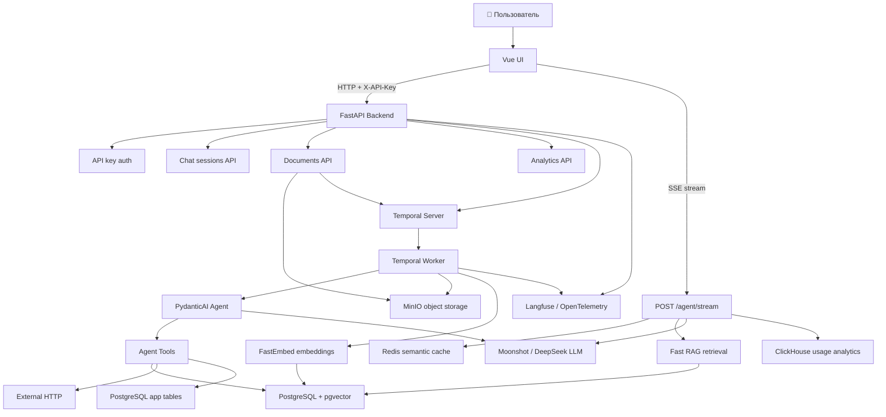
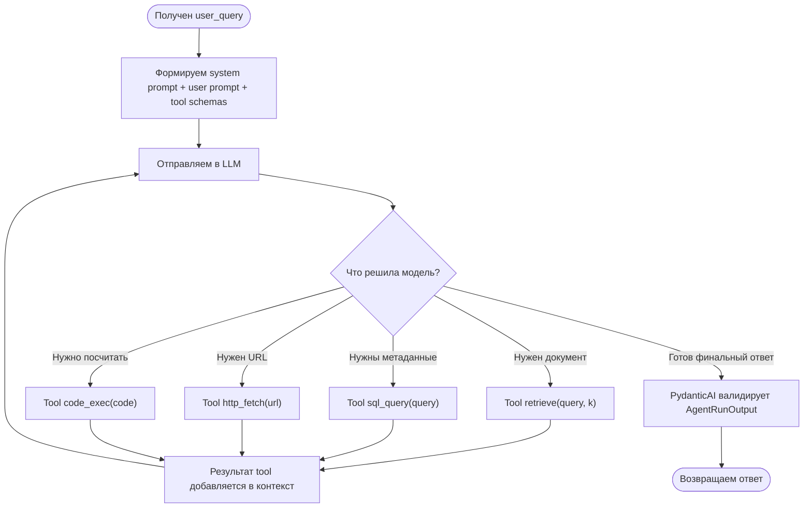
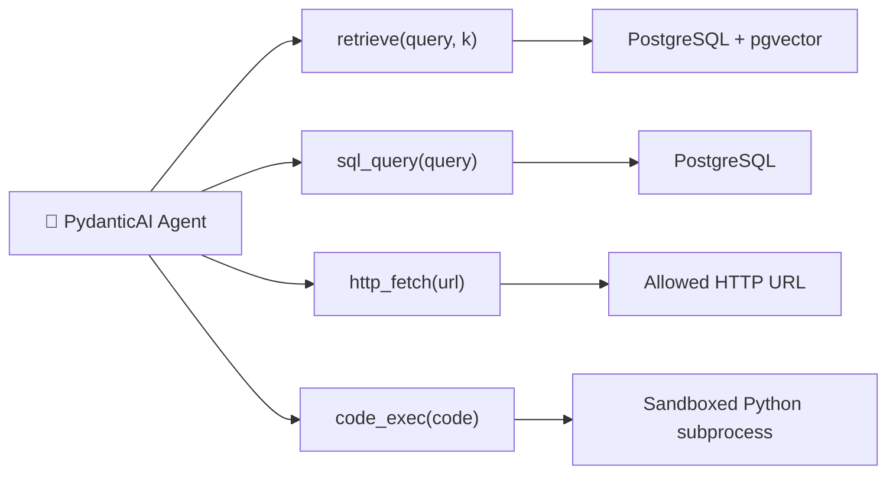
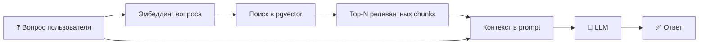
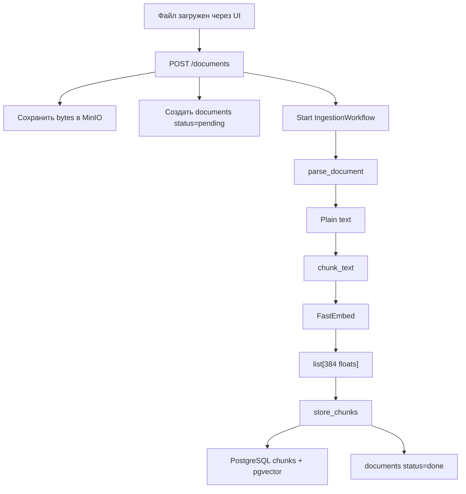
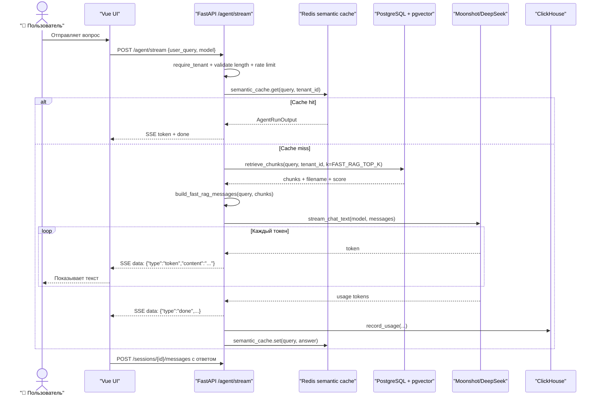
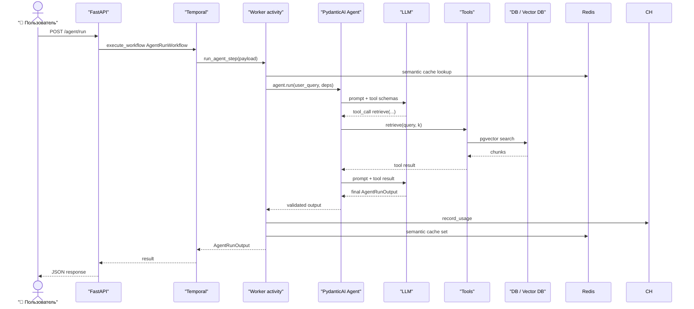

# 📖 AI Agent Platform — Полная документация

## Содержание

1. 🧠 Что это такое и зачем
2. 🗺️ Общая карта системы
3. 🧱 Стек технологий
4. 🤖 Как работает агент — главная глава
5. 📚 RAG: документы, эмбеддинги и поиск по смыслу
6. 🗂️ Структура проекта
7. 🔄 Полный флоу запроса
8. ⚙️ Переменные окружения
9. 🚀 Запуск проекта
10. 💸 Стоимость и лимиты
11. 🧩 Ключевые решения — почему так, а не иначе
12. ❓ FAQ для новичка в AI

---

## 1. 🧠 Что это такое и зачем

AI Agent Platform — это приложение, в которое пользователь загружает документы, а потом задаёт вопросы по этим документам в чате. Система сама находит нужные фрагменты в базе знаний, отправляет их в языковую модель и показывает ответ пользователю. Если говорить языком обычной разработки: это backend + frontend + хранилища, где вместо фиксированной бизнес-логики часть решений принимает LLM.

LLM, или Large Language Model, — это большая языковая модель. Аналогия для разработчика: представь функцию `generateAnswer(prompt)`, которая принимает текстовую инструкцию и возвращает текст, но внутри умеет понимать естественный язык, переформулировать, обобщать и выбирать следующий шаг. В этом проекте LLM нужна не для магии, а для задач, где обычный `if/else` быстро становится невозможным: пользователь может спросить одно и то же тысячей способов, документы могут быть разного формата, а ответ нужно собрать из нескольких фрагментов.

Почему не просто “вызвать ChatGPT”? Потому что ChatGPT сам по себе не знает ваши локальные документы, не умеет безопасно читать вашу базу, не знает `tenant_id`, не сохраняет события в вашу аналитику и не запускает Temporal workflows. Этот проект строит вокруг LLM прикладную систему: авторизация, загрузка файлов, индексация, поиск, кэш, лимиты, стоимость, стриминг, workflow-ретраи и human-in-the-loop.

Почему это сделано как агент? Агент — это LLM плюс набор инструментов, которые модель может вызвать. Tool calling — это как callback-функции, только не код решает `if should_call_tool`, а модель по описанию инструмента решает: “мне нужно вызвать `retrieve(query)`” или “мне нужно сделать `sql_query(...)`”. В проекте есть два режима: быстрый RAG-stream для обычного чата и более тяжёлый PydanticAI agent loop для workflow/HITL/research.

Что умеет система, чего не умел бы простой `if/else`:

- понимать вопросы в свободной форме;
- искать документы по смыслу, а не по точной строке;
- комбинировать найденные фрагменты в связный ответ;
- вызывать tools, когда модели нужны данные;
- стримить ответ по мере генерации;
- кэшировать похожие вопросы через semantic cache;
- запускать долгие процессы через Temporal и переживать рестарты worker’а.

---

## 2. 🗺️ Общая карта системы



`Vue UI` — браузерный интерфейс. Он похож на обычную SPA-админку: хранит активную сессию чата, отправляет HTTP-запросы, читает streaming-ответ и показывает документы/аналитику.

`FastAPI Backend` — центральный HTTP слой. Он проверяет API-ключи, создаёт сессии, принимает файлы, запускает workflows и отдаёт SSE stream. SSE, или Server-Sent Events, — это как длинный HTTP-response, в который сервер постепенно дописывает события.

`/agent/stream` — быстрый путь обычного чата. Здесь нет полноценного agent loop с tools: backend сам делает retrieval, сам собирает prompt и напрямую стримит ответ LLM. Это сделано ради скорости.

`PydanticAI Agent` — агентный путь. Агент получает system prompt, user query, tools и ожидаемый тип результата `AgentRunOutput`. PydanticAI управляет tool calling и проверяет, что финальный ответ подходит под Pydantic-схему.

`Tools` — функции, которые агент может вызвать. Аналогия: это API методов, которые ты даёшь модели как SDK. В проекте tools: `retrieve`, `sql_query`, `http_fetch`, опционально `code_exec`.

`LLM` — языковая модель Moonshot/Kimi или DeepSeek. Она не “подключена к базе” напрямую. Она видит только текст prompt’а, описания tools и результаты tools, которые ей передали.

`PostgreSQL + pgvector` — обычная реляционная БД плюс векторный поиск. Векторная БД — это как обычная БД, только она умеет искать “похожие по смыслу” записи, а не только `WHERE title = '...'`.

`Redis semantic cache` — кэш похожих вопросов. Semantic cache — это как обычный cache по ключу, но ключом является не точная строка, а embedding вопроса.

`Temporal` — оркестратор долгих задач. Аналогия: если HTTP-запрос — это синхронный вызов функции, то workflow в Temporal — это durable job, который можно ретраить, ждать, сигналить и продолжать после рестарта.

`MinIO` — S3-подобное хранилище файлов. PostgreSQL хранит метаданные, MinIO хранит bytes исходных документов.

`ClickHouse` — аналитическая БД для событий LLM usage. Она нужна, чтобы быстро считать токены, стоимость и latency по tenant/model/provider.

`Langfuse / OpenTelemetry` — наблюдаемость. Langfuse в этом проекте также может хранить prompt версии, но если ключи не настроены, используется fallback prompt из кода.

Важное нестандартное место: README упоминает Bifrost как LLM gateway, и в `infra/bifrost/config.json` есть конфиг, но в текущем `docker-compose.yml` активного Bifrost-сервиса нет. Реальные LLM-вызовы сейчас идут напрямую через OpenAI-compatible API Moonshot/DeepSeek.

---

## 3. 🧱 Стек технологий

### Backend, AI и infrastructure

| Технология | Категория | Что это | Зачем в этом проекте |
|-----------|----------|---------|----------------------|
| Python 3.12 | Runtime | Язык backend-части. | API, worker, RAG, tools, LLM-клиент и миграции написаны на Python. |
| FastAPI | Backend API | Async web framework. | Все HTTP endpoints живут в `apps/api/main.py`. |
| Uvicorn | ASGI server | Сервер для FastAPI. | Запускает API-контейнер командой `uvicorn apps.api.main:app`. |
| Pydantic | Data validation | Типизированные модели данных. | Описывает API-схемы, agent input/output и settings. |
| Pydantic Settings | Config | Загрузка `.env` в typed settings. | `packages/core/settings.py` превращает env в объект `settings`. |
| PydanticAI | AI framework | Фреймворк для LLM-агентов с tools и structured output. | Строит `research-agent`, регистрирует tools и валидирует `AgentRunOutput`. Это легче, чем вручную парсить tool calls. |
| OpenAI Python SDK | LLM client | Клиент для OpenAI-compatible Chat Completions API. | Moonshot и DeepSeek имеют похожий API, поэтому можно использовать один клиент. |
| Moonshot/Kimi | LLM provider | Провайдер языковых моделей Kimi. | Основная strong model для сложных ответов и tool calling. |
| DeepSeek | LLM provider | Провайдер моделей DeepSeek. | Более дешёвая/быстрая модель для weak/simple задач. |
| Temporal Python SDK | Orchestration | Durable workflows и activities. | Ingestion, HITL и multi-step research идут через workflow. |
| PostgreSQL 16 | Database | Реляционная БД. | Документы, chunks, chat sessions, messages, API keys. |
| pgvector | Vector DB extension | Векторный поиск внутри PostgreSQL. | Хранит `embedding vector(384)` и ищет похожие chunks. |
| SQLAlchemy async | ORM/SQL | Python-инструмент для работы с SQL. | Модели и запросы к PostgreSQL. |
| asyncpg | DB driver | Async драйвер PostgreSQL. | Нужен SQLAlchemy для `postgresql+asyncpg`. |
| Alembic | Migrations | Версионирование схемы БД. | Миграции лежат в `migrations/versions`. |
| Redis | Cache | In-memory key-value storage. | Semantic cache и rate limiting. |
| ClickHouse | Analytics DB | Колонночная БД для аналитики. | LLM usage events: tokens, cost, latency. |
| clickhouse-connect | DB client | Python client для ClickHouse. | Запись и чтение usage analytics. |
| MinIO | Object storage | S3-compatible хранилище. | Исходные документы пользователя. |
| minio Python SDK | Object client | Клиент MinIO. | `object_store.put/get` в `packages/storage/object_store.py`. |
| FastEmbed | Embeddings | Локальная библиотека для эмбеддингов. | Считает vectors для документов и вопросов. |
| BAAI/bge-small-en-v1.5 | Embedding model | Модель, превращающая текст в 384-мерный vector. | Используется для RAG-поиска. |
| MarkItDown | Document parsing | Парсер разных форматов в plain text. | DOCX/TXT/MD/CSV/HTML и часть других файлов превращаются в текст. |
| PyMuPDF | PDF parsing | Библиотека чтения PDF. | PDF парсятся отдельно, потому что PyMuPDF хорошо извлекает текстовый слой. |
| langchain-text-splitters | Chunking | Разбиение текста на chunks. | `RecursiveCharacterTextSplitter` режет документы на куски с overlap. |
| httpx | HTTP client | Async HTTP-запросы. | Используется tool’ом `http_fetch`. |
| python-multipart | Uploads | Поддержка multipart/form-data. | Нужен для `POST /documents` и bulk upload. |
| Langfuse | LLM observability | Prompt management, traces, analytics. | Prompt может подтягиваться из Langfuse, fallback лежит в коде. |
| OpenTelemetry | Observability | Стандарт трассировки. | `setup_tracing` подключается в API и worker. |
| structlog | Logging | Структурированные логи. | Зависимость есть, но основная настройка сейчас через `logging.basicConfig`. |
| Docker Compose | Local infra | Запуск многих сервисов одной командой. | Поднимает БД, Redis, MinIO, Temporal, Langfuse, API, worker, UI. |
| Ruff | Dev tooling | Линтер и форматтер. | `make lint`, `make format`. |
| mypy | Dev tooling | Проверка типов. | Настроен strict mode. |
| pytest | Tests | Тестовый framework. | `make test`. |
| pytest-asyncio | Tests | Async-тесты. | Нужен для async backend кода. |
| pytest-cov | Tests | Покрытие тестов. | Для coverage report. |
| greenlet | SQLAlchemy support | Низкоуровневая зависимость SQLAlchemy. | Требуется SQLAlchemy async stack. |

### Frontend

| Технология | Категория | Что это | Зачем в этом проекте |
|-----------|----------|---------|----------------------|
| Vue 3 | Frontend framework | Реактивный UI-фреймворк. | Основной интерфейс: чат, документы, аналитика, настройки. |
| Pinia | State management | Store для Vue. | `chat.js` хранит сессии, сообщения, loading state и streaming state. |
| Vue Router | Routing | Client-side маршруты. | `/chat`, `/documents`, `/analytics`; `/workflows` редиректит в чат. |
| Vite | Build tool | Dev server и сборка frontend. | Локальная разработка и production build. |
| @vitejs/plugin-vue | Build plugin | Плагин Vue для Vite. | Позволяет Vite собирать `.vue` компоненты. |

### Почему не LangChain / LlamaIndex / CrewAI?

В проекте нет LangChain как agent framework, есть только `langchain-text-splitters` для chunking. Агентный слой построен на PydanticAI. Это более узкий и типизированный выбор: проекту нужны tools и structured output, но не нужен большой графовый framework.

LlamaIndex обычно выбирают, когда главный центр системы — сложный document/RAG pipeline. Здесь RAG pipeline написан кастомно: MinIO → parser → chunks → FastEmbed → pgvector.

CrewAI/AutoGen обычно нужны для мультиагентных сценариев, где несколько агентов общаются друг с другом. В этом проекте настоящей мультиагентности нет: есть `MultiStepResearchWorkflow`, который запускает несколько child workflows параллельно, но это fan-out/fan-in orchestration, а не чат агентов между собой.

MCP, Model Context Protocol, в проекте не используется. Ни MCP-серверов, ни MCP-клиентов, ни конфигов подключения не найдено.

---

## 4. 🤖 Как работает агент — главная глава

### 4.1 Что такое агент в этом проекте

В этом проекте “агент” — это PydanticAI объект, созданный в `packages/agents/base.py`:

```python
Agent(
    model=build_model(model_name),
    deps_type=AgentDeps,
    result_type=AgentRunOutput,
    system_prompt=get_system_prompt(),
)
```

`model` — LLM, например Kimi или DeepSeek. `deps_type` — зависимости выполнения, сейчас это `tenant_id` и список источников. `result_type` — Pydantic-схема финального ответа:

```json
{
  "answer": "Финальный ответ пользователю",
  "confidence": 0.85,
  "sources": ["license.txt"],
  "cached": false
}
```

Агент умеет:

- искать chunks в базе знаний через `retrieve`;
- читать ограниченные таблицы через `sql_query`;
- получать внешний URL через `http_fetch`;
- выполнять маленький Python snippet через `code_exec`, если `ENABLE_CODE_EXEC=true`;
- вернуть структурированный финальный ответ `AgentRunOutput`.

Триггеры запуска агента:

- `POST /agent/run` — обычный agent workflow через Temporal;
- `POST /agent/run` с `require_approval=true` — agent workflow + human approval;
- `POST /agent/research` — multi-step workflow с child workflows.

Важно: обычный UI-чат сейчас использует не этот agent loop, а быстрый endpoint `POST /agent/stream`. Там backend сам делает retrieval и напрямую зовёт LLM. Это осознанная оптимизация скорости.

### 4.2 Agent Loop — цикл работы агента

Agent loop — это цикл “LLM → tool → LLM → tool → final answer”. Аналогия: обычная программа сама вызывает функции по `if/else`, а agent loop отдаёт LLM право выбрать следующую функцию из разрешённого списка.



Шаги внутри:

1. Backend или worker получает `user_query`.
2. PydanticAI собирает system prompt, user prompt и JSON-описания tools.
3. LLM получает текст и список доступных функций.
4. Если модели не хватает данных, она возвращает tool call, например `retrieve`.
5. Python-код реально выполняет tool.
6. Результат tool добавляется в новое сообщение для LLM.
7. LLM снова думает над уже расширенным контекстом.
8. Когда данных достаточно, модель возвращает финальный structured output.
9. PydanticAI проверяет, что ответ можно превратить в `AgentRunOutput`.

Что происходит внутри LLM, когда она “принимает решение”? Важно не мистифицировать: модель не выполняет Python и не читает базу напрямую. Она генерирует следующий текстовый/JSON-токен на основе prompt’а, описаний tools и предыдущих сообщений. Tool calling — это договорённый формат ответа модели: вместо обычного текста она может вернуть “вызови функцию X с такими аргументами”.

### 4.3 System Prompt

System prompt — это инструкция верхнего уровня. Аналогия: это README для модели на каждый запрос. Он говорит, какую роль выполнять, какие инструменты есть и какие правила ответа соблюдать.

Fallback prompt для structured agent:

```text
You are a helpful research assistant grounded in the user's knowledge base.

Available tools:
- retrieve      : search the vector knowledge base for relevant chunks
- sql_query     : run a SELECT against the documents/chunks tables
- http_fetch    : fetch content from an external URL
- code_exec     : run a Python snippet for computation or data transformation

When answering:
1. Call retrieve first for knowledge-base questions.
2. Use sql_query to look up document metadata or counts.
3. Use http_fetch only when you need fresh external content.
4. Use code_exec for calculations or non-trivial data wrangling.

Always set confidence in [0,1]. In sources, list ONLY the filename of each
document whose content you directly cited or paraphrased in your answer.
If a retrieved chunk was not helpful, do not include its filename. Never invent filenames.
```

Streaming prompt похожий, но просит plain text, потому что streaming path работает с текстовым ответом:

```text
Respond in clear, concise plain text.
If the knowledge base contains no relevant information, say so directly.
```

Почему prompt написан так:

- “grounded in knowledge base” снижает шанс hallucination, то есть выдуманных фактов;
- список tools объясняет модели доступные “callback-функции”;
- “Call retrieve first” направляет модель к RAG перед ответом;
- “Never invent filenames” защищает UI от фальшивых sources;
- `confidence in [0,1]` нужен для Pydantic-схемы.

Если изменить prompt:

- убрать `retrieve first` — агент может отвечать из общих знаний вместо документов;
- убрать запрет на выдуманные filenames — sources станут ненадёжными;
- сделать prompt слишком длинным — вырастут токены и стоимость;
- добавить бизнес-правила — агент начнёт следовать им, если они не конфликтуют с user prompt и tools.

Langfuse: `get_system_prompt()` сначала пытается получить prompt `research-agent` с label `production` из Langfuse. Если ключей нет или Langfuse недоступен, используется fallback из кода.

### 4.4 Tools / Инструменты агента



Tool — это функция, которую модель может попросить вызвать. Для разработчика это похоже на публичный метод SDK, только caller — LLM.

#### `retrieve(query, k=5)`

Что делает: ищет релевантные chunks в базе знаний tenant’а через embeddings и pgvector.

Когда агент вызывает: когда вопрос может относиться к загруженным документам.

Параметры:

```json
{
  "query": "кто автор лицензии и что это за проект",
  "k": 5
}
```

Возвращает:

```json
[
  {
    "document_id": "56ee3351-fa70-4192-bd4c-10e06c78c879",
    "filename": "license.txt",
    "content": "MIT License ...",
    "score": 0.82
  }
]
```

`score` — это похожесть. В коде pgvector считает cosine distance, а score = `1 - distance`.

#### `sql_query(query)`

Что делает: выполняет read-only SQL SELECT по разрешённым таблицам.

Когда агент вызывает: когда нужны метаданные: сколько документов, какие статусы, какие сообщения, какие chunks есть.

Ограничения безопасности:

- обязателен `{tenant_id}` в запросе;
- запрещены `INSERT`, `UPDATE`, `DELETE`, `DROP`, `ALTER`, `CREATE`;
- запрещены `api_keys`, `pg_catalog`, `information_schema`;
- разрешены только `documents`, `chunks`, `chat_sessions`, `chat_messages`;
- лимит 500 строк, если нет `LIMIT`;
- `SET TRANSACTION READ ONLY`;
- `statement_timeout = 5000`.

Пример tool call:

```json
{
  "query": "SELECT filename, status, size_bytes FROM documents WHERE tenant_id = '{tenant_id}' LIMIT 20"
}
```

Пример результата:

```json
[
  {
    "filename": "project.md",
    "status": "done",
    "size_bytes": 18432
  }
]
```

Если SQL падает, tool возвращает ошибку как данные, а не бросает exception:

```json
[
  {
    "error": "SQL execution failed: relation \"documnts\" does not exist"
  }
]
```

#### `http_fetch(url)`

Что делает: загружает текст внешнего URL до 20 000 символов.

Когда агент вызывает: когда нужна свежая внешняя документация или web/API ответ.

Параметры:

```json
{
  "url": "https://docs.python.org/3/library/json.html"
}
```

Возвращает plain text или ошибку:

```json
"HTTP 404: Not Found"
```

SSRF-защита: в production нужно задать `HTTP_FETCH_ALLOWED_DOMAINS`. SSRF — это атака, где сервер заставляют сходить во внутреннюю сеть. Аналогия: пользователь просит курьера принести публичную страницу, а на самом деле отправляет его в закрытый офис.

#### `code_exec(code)`

Что делает: выполняет маленький Python snippet в subprocess.

Когда агент вызывает: когда нужно посчитать, преобразовать JSON, сделать небольшую обработку данных.

По умолчанию выключен. Включается только `ENABLE_CODE_EXEC=true`.

Параметры:

```json
{
  "code": "import json\nprint(json.dumps({'answer': 2 + 2}))"
}
```

Возвращает:

```json
"{\"answer\": 4}"
```

Ограничения:

- timeout 10 секунд;
- пустое окружение без секретов;
- `python -S -E`, то есть без site-packages и env-переменных;
- доступна только стандартная библиотека.

### 4.5 MCP

MCP, Model Context Protocol, — это стандартный способ подключать внешние инструменты к AI-агенту. Представь это как USB: один стандартный разъём, через который агент может подключить “устройства” вроде файловой системы, GitHub, браузера, базы данных или почты.

В этом проекте MCP не используется:

- нет MCP-серверов в `docker-compose.yml`;
- нет MCP client dependency в `pyproject.toml`;
- tools регистрируются напрямую через PydanticAI decorators;
- frontend/backend не вызывают MCP endpoints.

Что используется вместо MCP: локальные Python tools (`retrieve`, `sql_query`, `http_fetch`, `code_exec`). Это проще и прозрачнее для текущего проекта. MCP имело бы смысл, если нужно было бы подключать внешние инструменты стандартным способом: например GitHub, Slack, filesystem, browser automation или CRM.

### 4.6 Context Window и Memory

Context window — это максимальный объём текста, который LLM видит в одном запросе. Аналогия: это размер стека вызова или буфера. Если туда не положить данные, модель их не знает. Если положить слишком много, растёт стоимость и может падать качество.

Что попадает в контекст в fast streaming path `/agent/stream`:

- system message с правилом отвечать только по контексту;
- текущий user query;
- top-N chunks из RAG, ограниченные `FAST_RAG_TOP_K` и `FAST_RAG_CONTEXT_MAX_CHARS`.

Что не попадает в контекст fast path:

- вся история чата;
- все документы целиком;
- все chunks;
- приватные env-секреты;
- цепочка рассуждений модели.

Chain of thought — это внутренние рассуждения модели. В проекте они не сохраняются и не показываются. Более того, для Kimi/DeepSeek в коде явно добавляется `thinking: {"type": "disabled"}` для совместимости и снижения лишнего reasoning overhead.

Memory в проекте:

- долгосрочная память документов: `documents` + `chunks` + embeddings;
- история чатов: `chat_sessions` + `chat_messages`, но fast LLM prompt её сейчас не использует;
- semantic cache: Redis хранит похожие вопросы и ответы примерно на 1 час;
- HITL pending state во frontend: `localStorage` map workflow IDs.

Если context window заполняется, текущий код не делает summarization history. Вместо этого fast path заранее режет RAG context через `FAST_RAG_CONTEXT_MAX_CHARS`. Это простое и предсказуемое решение.

---

## 5. 📚 RAG

RAG, Retrieval Augmented Generation, — это когда перед отправкой вопроса в LLM мы сначала находим нужные документы в базе и добавляем их в prompt. Аналогия: вместо того чтобы просить junior-разработчика ответить по памяти, ты сначала даёшь ему нужные фрагменты документации.



Эта схема описывает runtime-запрос. Сначала вопрос превращается в embedding, затем PostgreSQL/pgvector ищет похожие embeddings chunks, потом найденные куски добавляются в prompt.

### Как документы попадают в векторную БД



Ingestion pipeline:

1. API читает upload с лимитом размера.
2. Исходный файл сохраняется в MinIO.
3. В `documents` создаётся строка со статусом `pending`.
4. API запускает `IngestionWorkflow`.
5. Worker ставит статус `processing`.
6. `parse_document` извлекает текст: PDF через PyMuPDF, остальные форматы через MarkItDown.
7. `chunk_text` режет текст на куски по `CHUNK_SIZE` и `CHUNK_OVERLAP`.
8. `embed_texts` считает embedding каждого chunk.
9. `store_chunks` пишет chunks и vectors в PostgreSQL.
10. Статус документа становится `done`.

### Что такое embeddings

Embedding — это массив чисел, который кодирует смысл текста. В проекте используется `BAAI/bge-small-en-v1.5`, размер вектора `384`. Для разработчика можно думать так: это не hash, потому что похожие тексты дают похожие vectors. Обычный hash меняется полностью при изменении одного символа, а embedding сохраняет близость по смыслу.

Пример концептуально:

```json
{
  "text": "MIT License",
  "embedding": [0.012, -0.044, 0.108, "... 381 more floats"]
}
```

### Как определяется релевантность

`retrieve_chunks()` считает cosine distance:

- `0` — очень похоже;
- больше — хуже;
- `score = 1 - distance`.

Запрос фильтруется через `RETRIEVAL_MAX_DISTANCE`. Если дистанция больше порога, chunk не попадёт в контекст. Это защищает от нерелевантных документов, но если порог слишком строгий, система может сказать “не нашёл релевантной информации”.

### Какая векторная БД используется и почему

Используется PostgreSQL + pgvector, а не Pinecone/Qdrant/Chroma. Причина видна по архитектуре: проект уже хранит документы и tenants в PostgreSQL, а pgvector позволяет добавить vector search без отдельного сервиса. Для MVP и небольшого/среднего объёма это проще в эксплуатации.

Альтернативы:

- Qdrant — сильный отдельный vector DB, хорош при большом объёме и сложных payload filters;
- Pinecone — managed vector DB, меньше DevOps, но платный внешний сервис;
- Chroma — удобен для локальных прототипов;
- ParadeDB/VectorChord — варианты усилить PostgreSQL-подход.

---

## 6. 🗂️ Структура проекта

```text
ai-agent-platform/
├── apps/
│   ├── api/
│   │   └── main.py                 # FastAPI endpoints, auth dependency, SSE stream, sessions, docs
│   ├── ui/
│   │   ├── Dockerfile              # Сборка Vue UI в nginx/static container
│   │   ├── package.json            # Vue/Pinia/Router/Vite зависимости
│   │   └── src/
│   │       ├── composables/
│   │       │   └── useApi.js        # apiFetch и apiStreamFetch с X-API-Key
│   │       ├── stores/
│   │       │   ├── chat.js          # Chat state, sessions, SSE parsing, HITL pending
│   │       │   └── settings.js      # API key/base URL в localStorage
│   │       ├── router/
│   │       │   └── index.js         # /chat, /documents, /analytics, /workflows redirect
│   │       ├── views/               # ChatView, DocumentsView, AnalyticsView, Settings
│   │       └── components/          # UI-компоненты чата, документов, layout
│   └── worker/
│       ├── main.py                  # Temporal worker entrypoint
│       ├── activities/
│       │   ├── agent_step.py        # PydanticAI agent activity + semantic cache + usage
│       │   ├── ingestion.py         # parse/chunk/embed/store document activities
│       │   └── human_approval.py    # activity для HITL approval notification
│       └── workflows/
│           ├── agent_run.py         # AgentRunWorkflow с optional approve/reject
│           ├── ingestion.py         # IngestionWorkflow
│           └── multi_step.py        # Fan-out child workflows + synthesis
├── packages/
│   ├── agents/
│   │   ├── base.py                  # build_research_agent, register tools
│   │   ├── deps.py                  # AgentDeps: tenant_id, sources
│   │   ├── prompts.py               # System prompts + Langfuse fallback
│   │   ├── schemas.py               # AgentRunInput/Output, MultiStepResearchInput
│   │   └── tools/
│   │       ├── retrieve.py           # RAG search tool
│   │       ├── sql_query.py          # Safe read-only SQL tool
│   │       ├── http_fetch.py         # HTTP fetch tool with SSRF guard
│   │       └── code_exec.py          # Optional sandboxed Python tool
│   ├── rag/
│   │   ├── parser.py                # PDF/MarkItDown text extraction
│   │   ├── chunker.py               # RecursiveCharacterTextSplitter
│   │   ├── embedder.py              # FastEmbed lazy singleton
│   │   └── retriever.py             # pgvector semantic search
│   ├── llm/
│   │   └── client.py                # Moonshot/DeepSeek OpenAI-compatible client
│   ├── cache/
│   │   ├── redis.py                 # Redis client
│   │   └── semantic.py              # Semantic cache over Redis ZSET + vectors
│   ├── storage/
│   │   ├── models.py                # SQLAlchemy tables
│   │   ├── db.py                    # async engine + tenant_session RLS
│   │   └── object_store.py          # MinIO wrapper
│   ├── analytics/
│   │   ├── events.py                # ClickHouse usage insert
│   │   └── pricing.py               # Approx model prices
│   ├── auth/
│   │   └── api_keys.py              # API key generation/hash/require_tenant
│   └── core/
│       ├── settings.py              # Typed env config
│       └── tenant_utils.py          # tenant checks for workflow IDs
├── migrations/
│   └── versions/                    # Alembic migrations: docs, chunks, RLS, chat, size
├── infra/
│   ├── clickhouse/init.sql          # analytics.llm_usage_events
│   ├── postgres/init.sql            # Postgres init
│   └── bifrost/config.json          # Bifrost config exists, service not active in compose
├── scripts/
│   ├── backup.py                    # Backup helper
│   └── seed.sh                      # Seed helper
├── tests/                           # pytest tests
├── docker-compose.yml               # Local infra + app services
├── Dockerfile                       # Python API/worker image
├── Makefile                         # up/down/logs/test/lint/migrate
├── pyproject.toml                   # Python dependencies/tooling
├── .env.example                     # Env template
└── README.md                        # Older high-level project readme
```

AI-специфичные файлы, которые стоит читать первыми:

- `packages/agents/prompts.py` — как агенту объясняют поведение;
- `packages/agents/base.py` — где собирается PydanticAI agent;
- `packages/agents/tools/*.py` — какие tools доступны модели;
- `packages/rag/retriever.py` — как работает semantic search;
- `apps/api/main.py` — быстрый `/agent/stream` path;
- `apps/worker/activities/agent_step.py` — durable PydanticAI path;
- `packages/llm/client.py` — provider quirks Kimi/DeepSeek.

---

## 7. 🔄 Полный флоу запроса

Возьмём реальный сценарий: пользователь загрузил `license.txt`, потом спрашивает в чате: “кто автор лицензии и что за проект?”.

### Быстрый UI path: `/agent/stream`



Подробно:

1. UI создаёт user message и сохраняет его в текущую session.
2. UI открывает `fetch` на `/agent/stream` и читает `ReadableStream`.
3. Backend проверяет API key. Сырой ключ хэшируется SHA-256 и ищется в `api_keys`.
4. Backend получает `tenant_id` из ключа.
5. Rate limit хранится в Redis ключом вида `rl:{tenant_id}:agent:{minute}`.
6. Semantic cache ищет похожий прошлый вопрос. Для этого новый вопрос тоже превращается в embedding.
7. Если cache miss, backend ищет chunks через pgvector.
8. Backend строит prompt: system instruction + текущий вопрос + найденные chunks.
9. LLM начинает генерировать ответ. Backend не ждёт весь ответ, а сразу отправляет token events в UI.
10. После завершения backend пишет usage в ClickHouse и сохраняет ответ в semantic cache.

В этом path LLM не вызывает tools. Решение “какие documents взять” принимает backend retrieval code, а не модель. Это быстрее и дешевле, но менее гибко.

### Agent workflow path: `/agent/run`



Здесь агент действительно “решает”, нужен ли tool. На практике это означает: LLM генерирует специальный tool call в формате, который PydanticAI и provider понимают. Python-код выполняет этот tool, а результат возвращается обратно модели как новое сообщение.

Если `require_approval=true`, workflow после генерации ответа ждёт signal `approve` или `reject` до 24 часов. Это human-in-the-loop: человек может подтвердить или отклонить ответ.

---

## 8. ⚙️ Переменные окружения

| Переменная | Зачем нужна | Где взять | Обязательная? |
|-----------|-------------|-----------|---------------|
| `POSTGRES_USER` | Пользователь PostgreSQL. | Локально любое значение; default `postgres`. | Да для compose. |
| `POSTGRES_PASSWORD` | Пароль PostgreSQL. | Придумать локально; в prod хранить в secret manager. | Да. |
| `POSTGRES_DB` | Имя app database. | Обычно `app`. | Да. |
| `CLICKHOUSE_USER` | Пользователь ClickHouse. | Локально default `default`. | Да для analytics. |
| `CLICKHOUSE_PASSWORD` | Пароль ClickHouse. | Придумать/задать в `.env`. | Да. |
| `CLICKHOUSE_DB` | Имя БД ClickHouse. | Обычно `analytics`. | Да. |
| `MINIO_ROOT_USER` | Root user MinIO. | Локально можно `minioadmin`; в prod сменить. | Да. |
| `MINIO_ROOT_PASSWORD` | Root password MinIO. | Локально можно default; в prod сменить. | Да. |
| `LANGFUSE_NEXTAUTH_SECRET` | Secret для Langfuse auth. | Сгенерировать случайную строку. | Да для Langfuse container. |
| `LANGFUSE_SALT` | Salt для Langfuse. | Сгенерировать случайную строку. | Да для Langfuse. |
| `LANGFUSE_ENCRYPTION_KEY` | 64 hex chars для шифрования Langfuse. | `openssl rand -hex 32`. | Да для Langfuse. |
| `LANGFUSE_PUBLIC_KEY` | Public key проекта Langfuse. | Langfuse UI → Project Settings → API Keys. | Нет, есть fallback prompt. |
| `LANGFUSE_SECRET_KEY` | Secret key проекта Langfuse. | Langfuse UI → Project Settings → API Keys. | Нет, но нужен для prompt fetch/traces. |
| `LANGFUSE_HOST` | URL Langfuse. | Локально `http://localhost:3000`; в Docker API получает `http://langfuse-web:3000`. | Нет, есть default. |
| `MOONSHOT_API_KEY` | Ключ Moonshot/Kimi LLM. | Moonshot platform. Сервис платный, цена зависит от модели и токенов. | Да, если используешь Moonshot model. |
| `DEEPSEEK_API_KEY` | Ключ DeepSeek LLM. | DeepSeek API dashboard. Сервис платный, обычно дешевле strong Kimi. | Да, если используешь DeepSeek model. |
| `APP_ENV` | Режим окружения: local/prod. | Задать вручную. | Нет, default `local`. |
| `LOG_LEVEL` | Уровень логов. | `INFO`, `DEBUG`, `WARNING`. | Нет. |
| `ADMIN_SECRET` | Защищает `POST /auth/keys`. | Придумать; в prod обязательно сменить. | Да для создания API keys. |
| `STRONG_MODEL` | Основная сильная модель. | Формат `provider/model`, например `moonshot/kimi-k2-turbo-preview`. | Да для LLM. |
| `WEAK_MODEL` | Дешёвая/простая модель. | Формат `provider/model`, например `deepseek/deepseek-chat`. | Нет, но полезна. |
| `AGENT_QUERY_MAX_CHARS` | Максимальная длина вопроса. | Число символов, default `12000`. | Нет. |
| `AGENT_RATE_LIMIT_PER_MINUTE` | Лимит agent-запросов на tenant в минуту. | Число, default `20`. | Нет. |
| `LLM_TIMEOUT_SECONDS` | Таймаут LLM request. | Число секунд, default `60`. | Нет. |
| `RETRIEVAL_MAX_DISTANCE` | Порог релевантности chunks. | Float, default `0.75`. | Нет. |
| `FAST_RAG_TOP_K` | Сколько chunks брать в fast stream. | Integer, default `3`. | Нет. |
| `FAST_RAG_CONTEXT_MAX_CHARS` | Максимум символов RAG-контекста. | Integer, default `8000`. | Нет. |
| `TEMPORAL_ADDRESS` | Адрес Temporal server. | Локально `localhost:7233`, в Docker `temporal:7233`. | Да для workflows. |
| `TEMPORAL_NAMESPACE` | Namespace Temporal. | Обычно `default`. | Да. |
| `TEMPORAL_TASK_QUEUE` | Очередь worker tasks. | Обычно `agent-tasks`. | Да. |
| `DATABASE_URL` | SQLAlchemy URL PostgreSQL. | Собирается из Postgres credentials. | Да. |
| `REDIS_URL` | URL Redis. | Локально `redis://localhost:6379/0`. | Да. |
| `CLICKHOUSE_URL` | URL ClickHouse analytics DB. | Собирается из ClickHouse credentials. | Да для analytics. |
| `MINIO_ENDPOINT` | Адрес MinIO API. | Локально `localhost:9002`; в Docker `minio:9000`. | Да для файлов. |
| `MINIO_ACCESS_KEY` | Access key MinIO. | Обычно равен `MINIO_ROOT_USER`. | Да. |
| `MINIO_SECRET_KEY` | Secret key MinIO. | Обычно равен `MINIO_ROOT_PASSWORD`. | Да. |
| `MINIO_BUCKET` | Bucket для файлов. | Например `app-files`. | Да. |

Дополнительные settings есть в `packages/core/settings.py`, но не перечислены в `.env.example`: `EMBEDDING_MODEL`, `EMBEDDING_DIM`, `CHUNK_SIZE`, `CHUNK_OVERLAP`, `BUDGET_ALERT_USD_PER_CALL`, `ENABLE_CODE_EXEC`, `HTTP_FETCH_ALLOWED_DOMAINS`, `ALLOWED_ORIGINS`, `MAX_UPLOAD_BYTES`, `MAX_BULK_TOTAL_BYTES`.

Про AI-ключи:

- Moonshot/Kimi и DeepSeek — внешние платные API. Бесплатность и лимиты нужно проверять в кабинетах провайдеров.
- Стоимость зависит от tokens. Token — это кусочек текста, примерно 3-4 символа английского текста или меньше для других языков. Модель берёт оплату отдельно за input tokens и output tokens.
- Если ключ пустой, LLM-вызовы к соответствующему provider будут падать.

---

## 9. 🚀 Запуск проекта

### Шаг 1: Подготовка

Проверь, что установлены Docker, Git и Make:

```bash
docker --version
docker compose version
git --version
make --version
```

Если Docker не запущен, `docker compose up` не сможет поднять Postgres/Redis/Temporal/MinIO.

### Шаг 2: Ключи и конфиги

Скопируй env:

```bash
cp .env.example .env
```

Открой `.env` и заполни:

```bash
MOONSHOT_API_KEY=...
DEEPSEEK_API_KEY=...
ADMIN_SECRET=замени-на-свой-секрет
LANGFUSE_ENCRYPTION_KEY=<openssl rand -hex 32>
```

Сгенерировать Langfuse encryption key:

```bash
openssl rand -hex 32
```

Langfuse API keys можно добавить после первого запуска: открыть `http://localhost:3000`, создать проект, скопировать keys в `.env`, затем перезапустить containers.

### Шаг 3: Установка зависимостей

Для Docker-first сценария вручную ставить Python/Node зависимости не нужно: Docker соберёт образы.

Если хочешь локально разрабатывать frontend:

```bash
cd apps/ui
npm install
```

Если хочешь локально разрабатывать backend без контейнера:

```bash
pip install -e ".[dev]"
```

В README упоминается `uv sync`; Dockerfile действительно использует `uv sync --no-dev`.

### Шаг 4: Первый запуск

```bash
make up
```

Проверить контейнеры:

```bash
make ps
```

Посмотреть логи:

```bash
make logs
```

Ожидаемые признаки, что всё живо:

- UI открывается на `http://localhost:5173`;
- API health отвечает:

```bash
curl http://localhost:8000/health
```

Ответ:

```json
{"status":"ok"}
```

- Temporal UI открывается на `http://localhost:8233`;
- MinIO console открывается на `http://localhost:9001`;
- Langfuse открывается на `http://localhost:3000`.

### Шаг 5: Создать API key

```bash
curl -X POST http://localhost:8000/auth/keys \
  -H "Content-Type: application/json" \
  -H "X-Admin-Secret: change-me-before-deploy" \
  -d '{"tenant_id":"demo","name":"local-dev"}'
```

Ответ содержит `raw_key`. Его нужно вставить в UI settings. Сырой ключ показывается один раз, в базе хранится только SHA-256 hash.

### Шаг 6: Тест документа и чата

Создай простой файл:

```bash
printf "Project: AI Agent Platform\nLicense author: Denis\nPurpose: RAG assistant for documents\n" > /tmp/aap-test.txt
```

Загрузи документ:

```bash
curl -X POST http://localhost:8000/documents \
  -H "X-API-Key: <RAW_KEY>" \
  -F "file=@/tmp/aap-test.txt"
```

Подожди, пока status станет `done`:

```bash
curl http://localhost:8000/documents \
  -H "X-API-Key: <RAW_KEY>"
```

Проверь streaming endpoint:

```bash
curl -N -X POST http://localhost:8000/agent/stream \
  -H "Content-Type: application/json" \
  -H "X-API-Key: <RAW_KEY>" \
  -d '{"user_query":"кто автор лицензии и что за проект?"}'
```

Ты должен увидеть события вида:

```text
data: {"type":"token","content":"..."}

data: {"type":"done","answer":"...","sources":["aap-test.txt"],"confidence":0.85,"cached":false}
```

---

## 10. 💸 Стоимость и лимиты

Проект использует платные LLM API Moonshot/Kimi и DeepSeek. Стоимость считается по токенам.

Token — это кусок текста. Для разработчика можно представить, что prompt сериализуется в массив маленьких string fragments, и provider считает длину этого массива. Есть input tokens — что отправили модели, и output tokens — что модель сгенерировала.

Цены в коде `packages/analytics/pricing.py` указаны за 1 000 000 токенов:

| Модель | Input $/1M | Output $/1M | Комментарий |
|-------|------------|-------------|-------------|
| `kimi-k2.6` | 0.60 | 2.50 | Strong Kimi model. |
| `kimi-k2-turbo-preview` | 0.60 | 2.50 | Используется в `.env.example` как strong. |
| `deepseek-v4-flash` | 0.14 | 0.28 | Дешевле и быстрее для простых задач. |
| `deepseek-chat` | 0.14 | 0.28 | Alias в pricing code. |
| `deepseek-reasoner` | 0.55 | 2.19 | Reasoning model. |

Пример: запрос к Kimi, где 5 000 input tokens и 800 output tokens:

```text
input:  5 000 * $0.60 / 1 000 000 = $0.0030
output:   800 * $2.50 / 1 000 000 = $0.0020
total: $0.0050
```

Почему RAG влияет на стоимость: chunks добавляются в prompt, значит увеличивают input tokens. Чем больше `FAST_RAG_CONTEXT_MAX_CHARS`, тем больше потенциальная стоимость и latency.

Как не потратить лишнего:

- держать `FAST_RAG_TOP_K` небольшим;
- не отправлять всю историю чата без summarization;
- использовать semantic cache;
- включить rate limiting;
- на dev использовать дешёвую модель;
- следить за `/analytics/usage`;
- смотреть `BUDGET ALERT` в логах, если один вызов дороже `BUDGET_ALERT_USD_PER_CALL`.

Лимиты в проекте:

- `AGENT_RATE_LIMIT_PER_MINUTE` — сколько agent-запросов в минуту;
- `AGENT_QUERY_MAX_CHARS` — максимальная длина вопроса;
- `LLM_TIMEOUT_SECONDS` — сколько ждать LLM;
- `MAX_UPLOAD_BYTES` — размер одного файла;
- `MAX_BULK_TOTAL_BYTES` — суммарный размер bulk upload.

---

## 11. 🧩 Ключевые решения — почему так, а не иначе

**Решение:** Обычный чат идёт через `/agent/stream`, а не через полный agent workflow.  
**Почему:** Пользователь хочет видеть первый текст быстро. Fast path делает retrieval и прямой streaming LLM без PydanticAI loop.  
**Альтернатива:** Всегда использовать `/agent/run` через Temporal. Это надёжнее, но медленнее и хуже для UX интерактивного чата.

**Решение:** Temporal используется для ingestion и HITL.  
**Почему:** Обработка документов и ожидание approve могут длиться долго. Temporal сохраняет состояние и позволяет retry.  
**Альтернатива:** Background tasks в FastAPI. Проще, но хуже переживает рестарты и сложнее отслеживается.

**Решение:** pgvector вместо отдельной vector DB.  
**Почему:** Уже есть PostgreSQL, RLS и tenant tables. pgvector даёт semantic search без отдельной инфраструктуры.  
**Альтернатива:** Qdrant/Pinecone. Лучше для масштабного vector search, но добавляет сервис/стоимость.

**Решение:** Semantic cache в Redis.  
**Почему:** Похожие вопросы могут возвращать готовый ответ без LLM, это быстрее и дешевле.  
**Альтернатива:** Только точный HTTP cache. Он не поймает переформулированные вопросы.

**Решение:** API keys хранятся как SHA-256 hash.  
**Почему:** Если база утечёт, сырые ключи не лежат в таблице.  
**Альтернатива:** Хранить raw keys. Проще, но небезопасно.

**Решение:** `sql_query` tool возвращает ошибку как JSON-строку, а не роняет activity.  
**Почему:** LLM может увидеть ошибку и попробовать исправить запрос или объяснить пользователю проблему.  
**Альтернатива:** Бросать exception. Тогда workflow может упасть раньше, чем модель адаптируется.

**Решение:** Документы хранятся в MinIO, а chunks в PostgreSQL.  
**Почему:** Bytes файлов удобнее хранить как objects, а searchable text/vectors — в БД.  
**Альтернатива:** Класть всё в PostgreSQL. Проще на старте, но хуже для больших файлов.

**Решение:** Row Level Security через `tenant_id`.  
**Почему:** Даже если разработчик забудет фильтр, БД дополнительно защищает строки tenant’а.  
**Альтернатива:** Только фильтры в коде. Быстрее писать, но выше риск утечки данных между tenants.

---

## 12. ❓ FAQ для новичка в AI

### Почему агент иногда даёт разные ответы на один вопрос?

LLM генерирует текст вероятностно. Даже при одинаковом prompt provider может вернуть немного другой ответ, особенно если temperature не зафиксирована. В этом проекте `temperature` явно не задаётся в большинстве LLM-вызовов, значит используется default provider’а.

### Что такое temperature и почему она здесь именно такая?

Temperature — это параметр случайности генерации. Аналогия: при `0` модель выбирает самый вероятный следующий token, при больших значениях чаще выбирает альтернативы. В текущем коде temperature почти не управляется, потому что для RAG-ответов важнее стабильность prompt’а, retrieval и контекста. Если нужны более повторяемые ответы, стоит явно поставить низкую temperature.

### Почему нельзя просто сделать один большой prompt вместо агента с инструментами?

Можно, и fast `/agent/stream` почти так и делает: retrieval context + query → LLM. Но один большой prompt не умеет сам сходить в SQL, получить URL, выполнить расчёт или уточнить данные. Tools нужны, когда данные нужно получать динамически.

### Как агент знает, когда остановиться?

В PydanticAI path модель должна вернуть финальный результат в формате `AgentRunOutput`. Пока ей нужны данные, она может вернуть tool call. Когда модель возвращает structured output, PydanticAI валидирует его и завершает loop.

### Что делать, если LLM вернул невалидный JSON для tool call?

PydanticAI частично берёт это на себя: он знает schema tools/result и может ретраить/валидировать. Если проблема повторяется, нужно смотреть provider logs, system prompt и совместимость tool calling. В `packages/llm/client.py` уже есть provider-specific fixes для Kimi/DeepSeek.

### Почему используется именно Kimi/DeepSeek, а не OpenAI/Claude/Gemini?

Код построен вокруг OpenAI-compatible API. Moonshot и DeepSeek подходят под этот интерфейс и указаны в settings. OpenAI/Claude/Gemini можно добавить, но нужно прописать provider config, API key, model quirks и pricing.

### Зачем платить за API, если есть ChatGPT?

ChatGPT — это готовый продукт для человека. API — это строительный блок для приложения: можно передавать документы, управлять prompt, писать usage в ClickHouse, ограничивать tenants, стримить в свой UI и интегрировать workflows.

### Как понять, что агент “завис”?

Смотри логи API/worker. Для `/agent/stream` полезны сообщения:

- `agent_stream cache lookup`;
- `agent_stream retrieve`;
- `agent_stream first token`;
- `agent_stream done`.

Если `first token` долго не появляется, проблема до или во время первого ответа LLM: retrieval, embedding или provider latency. Если first token быстрый, но done долго, модель медленно генерирует длинный ответ.

### Как перезапустить?

Локально:

```bash
docker compose restart api worker
```

Если проблема в инфраструктуре:

```bash
docker compose ps
docker compose logs --tail=100 api worker temporal redis postgres
```

Temporal workflows не должны теряться при рестарте worker’а: worker переподключится и продолжит выполнять activities.

### Почему модель иногда отвечает “не нашёл релевантной информации”?

Fast RAG path фильтрует chunks по `RETRIEVAL_MAX_DISTANCE`. Если документы плохо распарсились, ещё не имеют status `done`, или вопрос слишком далёк от текста chunks, retrieval вернёт пустой список. Тогда backend специально не заставляет LLM фантазировать.

### Есть ли здесь настоящая мультиагентность?

Нет в смысле “несколько агентов общаются между собой”. Есть `MultiStepResearchWorkflow`: он запускает несколько child workflows по sub-queries и потом синтезирует финальный ответ. Это orchestration pattern, а не CrewAI/AutoGen-style multi-agent conversation.

### Есть ли MCP?

Нет. MCP в этом проекте не подключён. Tools реализованы напрямую в Python через PydanticAI.
