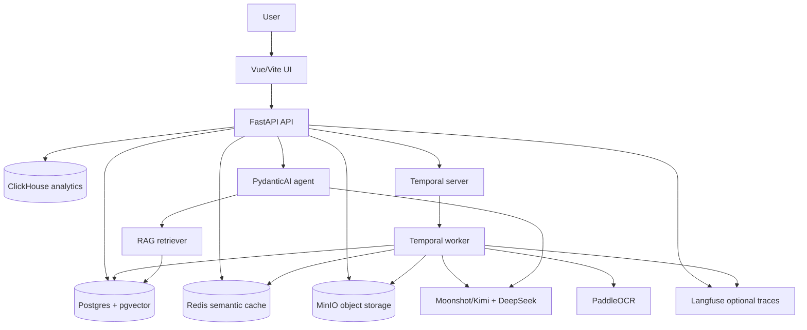
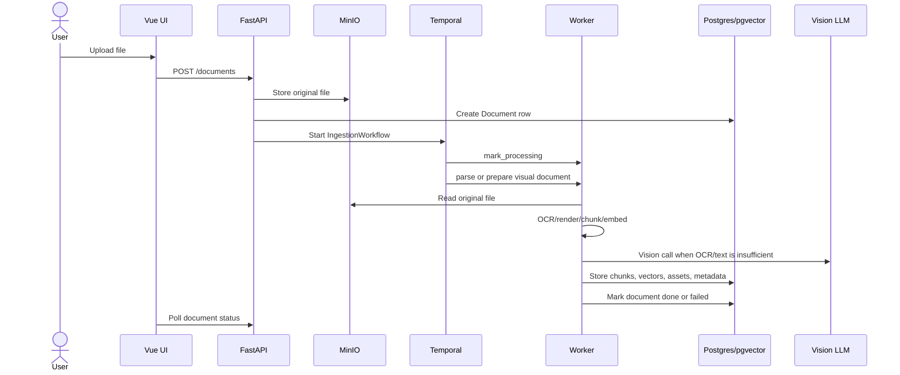
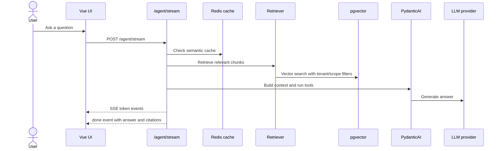

# AI Agent Platform

Self-hosted AI knowledge-base assistant with document ingestion, OCR/Vision processing,
RAG search, streaming chat, notebooks, tenant-scoped API keys, usage analytics, and
durable background workflows.

The project is designed for private/local deployments and small self-hosted teams
rather than public SaaS scale. It currently targets the 1-20 user range.

## What It Does

AI Agent Platform lets a user upload documents, scanned PDFs, and images, index their
content, and ask questions against that private knowledge base. The assistant can cite
the sources it used, stream answers in real time, and restrict retrieval to a single
document or a notebook of selected documents.

Long-running work such as file ingestion, OCR, Vision analysis, embedding generation,
and human approval is handled by Temporal workflows. Interactive chat uses FastAPI
streaming so the browser can show text as it is generated.

## Current Stack

| Layer | Technology | Purpose |
|---|---|---|
| Backend API | FastAPI | REST endpoints, SSE streaming, auth, document and notebook APIs |
| Frontend | Vue 3, Vite, Pinia | Browser UI for chat, documents, notebooks, analytics, settings |
| Agent framework | PydanticAI | Tool-calling agents with typed structured output |
| LLM providers | Moonshot/Kimi, DeepSeek via OpenAI-compatible clients | Main model, vision model, and cheaper helper model |
| Orchestration | Temporal Python SDK | Durable ingestion, agent runs with HITL, multi-step research |
| Main database | PostgreSQL 16 + pgvector | App state, tenants, documents, chunks, vectors, sessions, notebooks |
| Object storage | MinIO | Original uploads and protected generated assets/previews |
| Cache | Redis | Semantic cache and fast shared state |
| Analytics | ClickHouse | LLM usage events, cost and latency aggregation |
| Observability | Langfuse | Optional traces and prompt observability |
| Embeddings | fastembed | Local embedding generation for RAG chunks |
| OCR | PaddleOCR | Russian/English OCR for images and scanned PDF pages |
| PDF/image processing | PyMuPDF, Pillow | Page rendering, image conversion, visual extraction |
| Migrations | Alembic | PostgreSQL schema migrations |
| Tests | pytest, node:test | Backend/unit/workflow tests and frontend utility tests |

`infra/bifrost/` exists in the repository, but the current Docker Compose runtime does
not start Bifrost. The active LLM path is implemented in `packages/llm/client.py` using
OpenAI-compatible HTTP clients for Moonshot and DeepSeek.

## Architecture



The browser talks only to the API. The API owns tenant authentication, starts Temporal
workflows, performs fast interactive streaming, and exposes protected document assets.

Temporal is used for work that must survive restarts or retries: ingestion, OCR/Vision
batch processing, human approval, and multi-step research. LLM calls are kept inside
activities or API handlers, not inside deterministic workflow code.

Postgres stores the primary application data and vectors. MinIO stores uploaded files
and generated previews. Redis stores the semantic cache. ClickHouse receives usage
events; if analytics fails, the main answer path should continue.

## Main Runtime Flows

### Document Upload and Ingestion



Text files and normal PDFs are parsed into text segments. Images and scanned PDF pages
are rendered with bounded resolution, processed with PaddleOCR, optionally described by
the Vision model, then chunked and embedded into pgvector.

### Streaming Chat



Normal chat bypasses Temporal so the UI can receive tokens immediately. Human approval
and explicit workflow runs still use Temporal through `/agent/run`.

## Project Structure

```text
ai-agent-platform/
├── apps/
│   ├── api/
│   │   ├── main.py                 # FastAPI app lifecycle and router registration
│   │   ├── deps.py                 # Tenant/API-key dependency helpers
│   │   ├── schemas.py              # Public API schemas
│   │   ├── serializers.py          # DB model -> API response mapping
│   │   ├── routers/                # API route groups
│   │   │   ├── agent.py            # /agent/stream, /agent/run, /agent/research
│   │   │   ├── documents.py        # Upload, status, chunks, assets, reindex, delete
│   │   │   ├── notebooks.py        # Document collections and scoped chat sources
│   │   │   ├── sessions.py         # Chat sessions and message history
│   │   │   ├── workflows.py        # HITL result polling and approve/reject signals
│   │   │   ├── analytics.py        # Usage aggregation from ClickHouse
│   │   │   ├── auth.py             # Admin-protected tenant API-key creation
│   │   │   └── health.py           # /health
│   │   └── services/               # Shared route-level helpers
│   ├── ui/
│   │   └── src/                    # Vue application, stores, views, i18n, themes
│   └── worker/
│       ├── main.py                 # Temporal worker entrypoint
│       ├── workflows/              # Deterministic workflow definitions
│       │   ├── ingestion.py
│       │   ├── agent_run.py
│       │   └── multi_step.py
│       └── activities/             # Non-deterministic activity implementations
│           ├── agent_step.py
│           ├── ingestion.py        # Thin orchestration facade for ingestion activities
│           ├── ingestion_types.py
│           ├── ingestion_status.py
│           ├── document_chunks.py
│           ├── visual_analysis.py
│           └── visual_storage.py
├── packages/
│   ├── agents/                     # PydanticAI agents, prompts, tools, output schemas
│   ├── analytics/                  # ClickHouse usage recording and pricing helpers
│   ├── auth/                       # API-key generation and verification
│   ├── cache/                      # Redis and semantic cache
│   ├── core/                       # Settings and tenant utilities
│   ├── llm/                        # Provider/model factory and streaming helpers
│   ├── observability/              # Langfuse/OpenTelemetry setup
│   ├── rag/                        # Parsing, chunking, embeddings, retrieval, citations
│   └── storage/                    # SQLAlchemy models, DB sessions, MinIO wrapper
├── migrations/versions/            # Alembic migrations
├── infra/                          # Local service initialization files
├── scripts/                        # Seed and backup scripts
├── tests/unit/                     # Backend/unit/workflow tests
└── apps/ui/tests/                  # Frontend node:test suite
```

## API Overview

Most endpoints require:

```http
X-API-Key: <tenant-api-key>
```

Admin key creation requires:

```http
X-Admin-Secret: <ADMIN_SECRET>
```

| Method | Path | Purpose |
|---|---|---|
| `GET` | `/health` | API health check |
| `POST` | `/auth/keys` | Create a tenant API key |
| `POST` | `/agent/stream` | Interactive SSE chat with streamed tokens |
| `POST` | `/agent/run` | Temporal-backed agent run, optionally with human approval |
| `POST` | `/agent/research` | Multi-step research workflow |
| `GET` | `/workflows/{id}/result` | Poll HITL workflow result |
| `POST` | `/workflows/{id}/approve` | Approve a HITL workflow |
| `POST` | `/workflows/{id}/reject` | Reject a HITL workflow |
| `GET` | `/documents` | List tenant documents |
| `POST` | `/documents` | Upload one document/image |
| `POST` | `/documents/bulk` | Upload multiple files |
| `GET` | `/documents/{id}` | Get ingestion status and metadata |
| `GET` | `/documents/{id}/chunks` | Preview indexed chunks |
| `GET` | `/documents/{id}/assets` | List protected visual assets for a document |
| `GET` | `/documents/{id}/assets/{asset_id}/content` | Stream a protected preview through the API |
| `POST` | `/documents/{id}/reindex` | Rebuild chunks/assets/embeddings from the original object |
| `DELETE` | `/documents/{id}` | Delete document data and stored objects |
| `GET` | `/sessions` | List chat sessions |
| `POST` | `/sessions` | Create a chat session |
| `GET` | `/sessions/{id}/messages` | Read chat messages |
| `POST` | `/sessions/{id}/messages` | Persist a chat message |
| `GET` | `/notebooks` | List document collections |
| `POST` | `/notebooks` | Create a notebook |
| `GET` | `/notebooks/{id}` | Get notebook detail |
| `PUT` | `/notebooks/{id}/documents` | Replace notebook documents |
| `POST` | `/notebooks/{id}/documents/upload` | Upload a file directly into a notebook |
| `POST` | `/notebooks/{id}/insights` | Rebuild notebook summary/questions/topics |
| `GET` | `/analytics/usage` | Aggregate LLM usage from ClickHouse |

## Configuration

Copy the example file and fill secrets before starting the stack:

```bash
cp .env.example .env
```

Important variables:

| Variable | Required | Notes |
|---|---:|---|
| `POSTGRES_PASSWORD` | yes | Root Postgres password for local Compose |
| `APP_DB_PASSWORD` | yes | Runtime DB role password used by API/worker |
| `CLICKHOUSE_PASSWORD` | yes | ClickHouse password |
| `MINIO_ROOT_USER` / `MINIO_ROOT_PASSWORD` | yes | Object storage credentials |
| `LANGFUSE_NEXTAUTH_SECRET`, `LANGFUSE_SALT`, `LANGFUSE_ENCRYPTION_KEY` | yes for Langfuse | Generate locally with `openssl rand` |
| `MOONSHOT_API_KEY` | yes for Kimi | Main/vision provider key |
| `DEEPSEEK_API_KEY` | optional but expected | Weak/cheap model provider key |
| `ADMIN_SECRET` | yes | Protects `POST /auth/keys` |
| `VITE_API_BASE_URL` | optional | Defaults to `/api` for the Docker UI |
| `VITE_API_KEY` | optional | Local/private convenience only; bundled into the browser build |
| `APP_ENV` | optional | `local` by default; non-local rejects default admin secret and wildcard CORS |
| `ALLOWED_ORIGINS` | required outside local | Comma-separated or JSON array |
| `AGENT_RATE_LIMIT_PER_MINUTE` | optional | Per-tenant agent request guardrail |
| `AGENT_QUERY_MAX_CHARS` | optional | Rejects oversized prompts before LLM calls |
| `LLM_TIMEOUT_SECONDS` | optional | Default provider timeout |
| `BUDGET_ALERT_USD_PER_CALL` | optional | Logs a warning when one LLM call crosses this cost |
| `HTTP_FETCH_ALLOWED_DOMAINS` | optional | Explicit allowlist for URL/http tools; recommended for shared/LAN deployments |
| `ENABLE_CODE_EXEC` | optional | Enables the Python code execution tool; keep `false` unless isolated |
| `MAX_UPLOAD_BYTES`, `MAX_BULK_TOTAL_BYTES` | optional | File and bulk-upload memory guards |
| `RETRIEVAL_MAX_DISTANCE` | optional | Maximum vector distance accepted by retrieval |
| `OCR_LANGUAGE` | optional | Defaults to `ru`, which covers Russian and English OCR |
| `VISUAL_RENDER_MAX_DIMENSION` | optional | Caps rendered page/image size |

Generate local secrets, for example:

```bash
openssl rand -hex 32
openssl rand -base64 32
```

## Quickstart

### 1. Prerequisites

- Docker Desktop or Docker Engine with Compose
- Python 3.12
- Node.js 20+
- `uv` for Python dependency management

### 2. Configure environment

```bash
cp .env.example .env
```

Fill the required secrets in `.env`, including provider keys and `ADMIN_SECRET`.

### 3. Start the full local stack

```bash
docker compose up -d --build
```

This starts Postgres, Redis, ClickHouse, MinIO, Temporal, Langfuse, the API, the worker,
the migration container, and the UI.

### 4. Create a tenant API key

```bash
curl -X POST http://127.0.0.1:8000/auth/keys \
  -H 'Content-Type: application/json' \
  -H 'X-Admin-Secret: <ADMIN_SECRET>' \
  -d '{"tenant_id":"demo","name":"local"}'
```

Copy `raw_key` from the response.

For the browser UI, either paste the key into the Settings modal or set `VITE_API_KEY`
before building the UI image. Do not confuse this tenant key with provider keys such as
`MOONSHOT_API_KEY` or `DEEPSEEK_API_KEY`.

### 5. Open the app

| Service | URL |
|---|---|
| UI | http://127.0.0.1:5173 |
| API | http://127.0.0.1:8000 |
| OpenAPI | http://127.0.0.1:8000/openapi.json |
| Temporal UI | http://127.0.0.1:8233 |
| Langfuse | http://127.0.0.1:3000 |
| MinIO console | http://127.0.0.1:9001 |
| ClickHouse HTTP | http://127.0.0.1:8123 |

By default, Compose publishes ports to `127.0.0.1`. Set `HOST_BIND_ADDRESS=0.0.0.0`
only when you intentionally want LAN access.

## Development

Install Python dependencies:

```bash
uv sync
```

Run backend tests:

```bash
PYTHONPATH=$PWD .venv/bin/pytest -q
```

Run frontend tests:

```bash
cd apps/ui
npm test
```

Build the frontend:

```bash
cd apps/ui
npm run build
```

Validate Compose:

```bash
docker compose config --quiet
```

Run live e2e smoke tests only against an already running disposable local stack:

```bash
RUN_E2E_SMOKE=1 E2E_API_BASE_URL=http://127.0.0.1:8000 \
  PYTHONPATH=$PWD .venv/bin/pytest -q -m e2e tests/e2e
```

URL-image and mutable URL lifecycle e2e tests use a host fixture server. Recreate
`api` and `worker` with this flag before running them:

```bash
E2E_ALLOW_LOCAL_URL_SOURCES=true docker compose up -d --build api worker
```

Optional GitHub lifecycle e2e is opt-in because it depends on external network state:

```bash
RUN_E2E_SMOKE=1 RUN_E2E_GITHUB=1 \
E2E_GITHUB_URL=https://github.com/user/repo/tree/main/docs \
E2E_GITHUB_EXPECTED_SUBSTRING='text expected in retrieved chunks' \
PYTHONPATH=$PWD .venv/bin/pytest -q tests/e2e/test_url_github_lifecycle.py
```

Run API and worker manually against already running infrastructure:

```bash
uv run uvicorn apps.api.main:app --reload --port 8000
```

```bash
uv run python -m apps.worker.main
```

Useful Make targets:

| Target | Purpose |
|---|---|
| `make up` | Start the Compose stack |
| `make down` | Stop services without deleting volumes |
| `make down-volumes` | Stop services and delete local data |
| `make logs` | Tail service logs |
| `make ps` | Show service status |
| `make migrate` | Run Alembic migrations |
| `make test` | Run backend pytest through `uv` |
| `make backup` | Dump Postgres to MinIO using `scripts/backup.py` |

For full disaster recovery, use the backup and restore runbook:
[docs/runbooks/backup-restore.md](docs/runbooks/backup-restore.md).

## Data Model Summary

The main application data lives in Postgres. Key tables include:

- `api_keys` - tenant API keys, stored as hashes.
- `documents` - uploaded file metadata, ingestion status, progress, warnings, summaries.
- `chunks` - text chunks, page metadata, embeddings, and document links.
- `document_assets` - visual page/image metadata and protected preview object keys.
- `chat_sessions` and `chat_messages` - chat history and stored citations.
- `notebooks` and `notebook_documents` - document collections for scoped retrieval.

Object bytes live in MinIO. Vector search is done through pgvector columns in Postgres.
Usage events are written to ClickHouse.

## Security Notes

This project is suitable for local/private self-hosted use, not yet hardened as a
public multi-tenant SaaS.

Current guardrails:

- Tenant API keys are hashed server-side.
- Most API endpoints require `X-API-Key`.
- Document/session/notebook access is tenant-scoped.
- Runtime database access uses an app role instead of the root migration role.
- Non-local environments reject the default `ADMIN_SECRET`.
- Non-local environments require explicit `ALLOWED_ORIGINS` and reject wildcard CORS.
- Upload size limits are enforced.
- Agent prompt length and per-minute request limits are enforced.
- Protected visual assets are served through the API instead of direct MinIO URLs.

Known limitations:

- A UI key stored in localStorage is acceptable for private/local deployments, but not
  for a public web app. Use a stronger auth model before public exposure.
- `code_exec` is disabled by default. Treat it as dangerous if enabled.
- `http_fetch` is safest with an explicit `HTTP_FETCH_ALLOWED_DOMAINS` allowlist.
- Backup/restore should be tested before relying on the system for important data.

## Testing Baseline

The expected local baseline is that all commands below finish with exit code `0`.
Exact test counts change as the suite grows, so treat failures/errors as the signal,
not an old number in the README.

```bash
PYTHONPATH=$PWD .venv/bin/pytest -q
```

```bash
cd apps/ui
npm test
# frontend tests should pass
```

```bash
cd apps/ui
npm run build
# Vite build should complete
```

```bash
docker compose config --quiet
# exit 0
```

The repository has a CI workflow that runs backend tests, frontend tests, frontend
build, and Compose validation on pushes, pull requests, and manual dispatches.

Golden retrieval/OCR/Vision evals can be run against a local stack:

```bash
PYTHONPATH=$PWD python -m evals.runners.golden_eval
```

To include a GitHub source in the golden eval:

```bash
PYTHONPATH=$PWD python -m evals.runners.golden_eval \
  --include-github \
  --github-url https://github.com/user/repo/tree/main/docs \
  --github-expected-substring 'text expected in retrieved chunks'
```

## Operational Notes

- Ingestion failures should store a root-cause error on the document, not only a
  generic Temporal failure.
- Reindex/delete paths should invalidate semantic cache and avoid duplicate chunks or
  assets.
- Large OCR workloads are CPU-heavy. First OCR calls may be slower because PaddleOCR
  warms up its models.
- Langfuse is optional from the app's perspective. Missing Langfuse keys should not
  stop local development.
- ClickHouse analytics should not block the core answer path.
- Temporal workflow code must remain deterministic. Keep network calls, LLM calls,
  random values, wall-clock time, and file I/O inside activities or API handlers.

## Current Priorities

1. Run a manual restore drill from the backup/restore runbook and record the result.
2. Run live e2e smoke on a disposable tenant before merges that touch ingestion/RAG.
3. Expand golden eval datasets when adding a new source type or retrieval behavior.
4. Revisit browser auth before any public deployment.

## Useful Links

- PydanticAI: https://ai.pydantic.dev/
- Temporal Python SDK: https://docs.temporal.io/develop/python
- FastAPI: https://fastapi.tiangolo.com/
- Vue: https://vuejs.org/
- pgvector: https://github.com/pgvector/pgvector
- PaddleOCR: https://github.com/PaddlePaddle/PaddleOCR
- Langfuse: https://langfuse.com/docs
