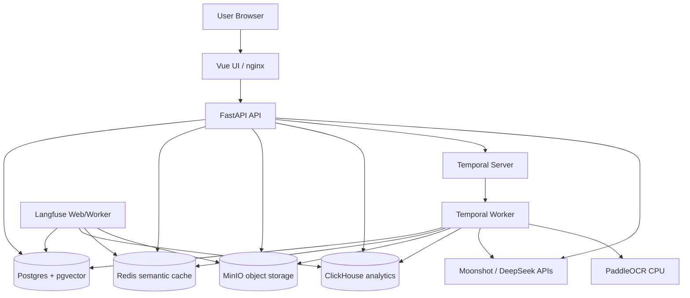
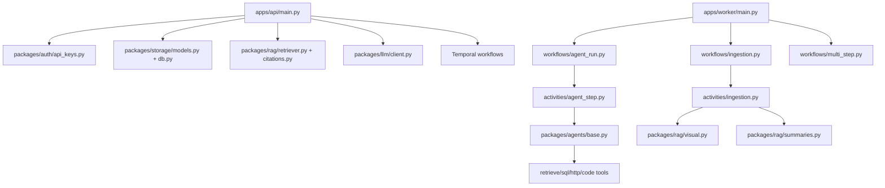
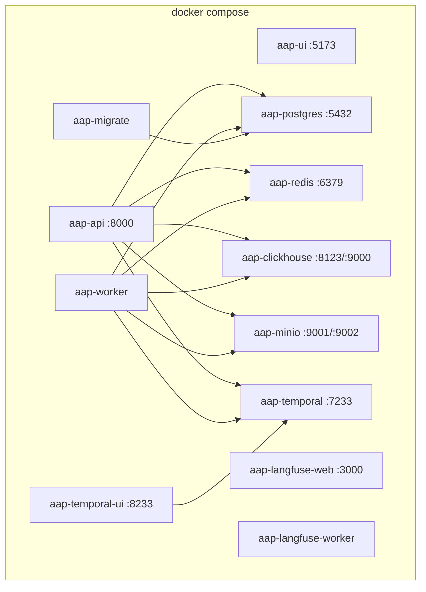
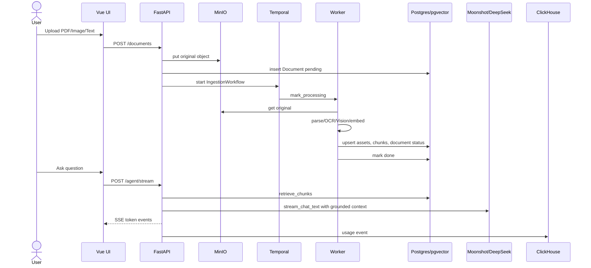
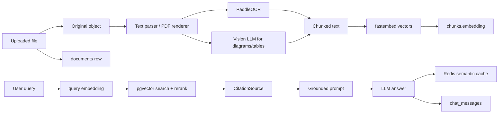
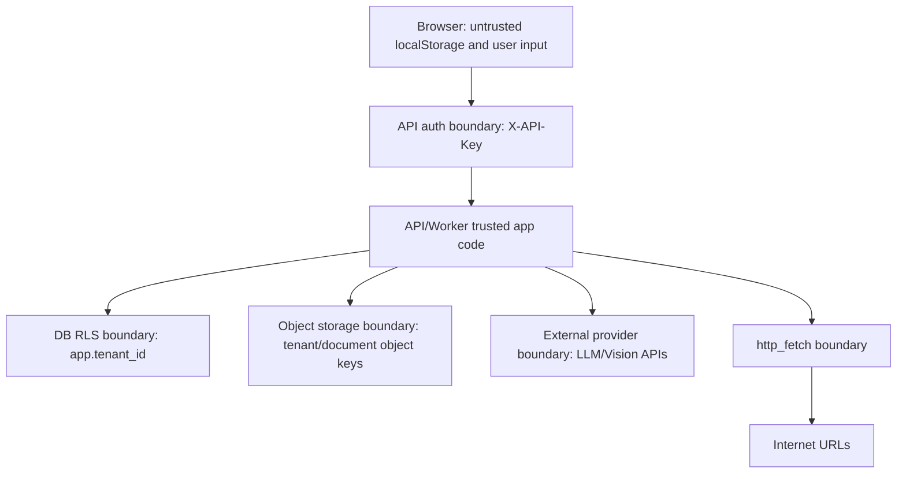
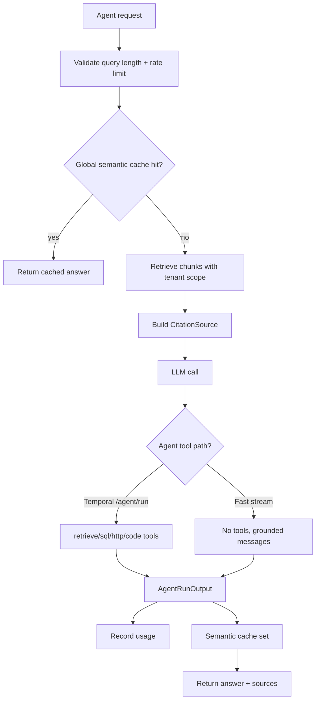
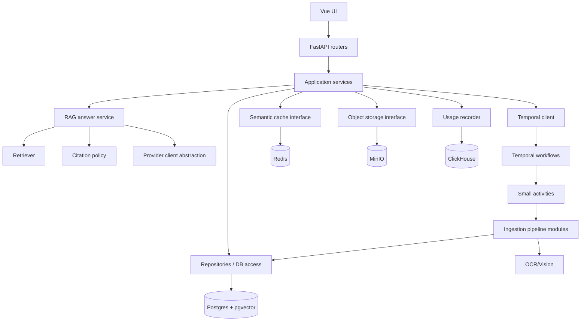

# Full Technical Audit: AI Agent Platform

Дата аудита: 2026-06-17  
Профиль оценки: private/self-hosted/local продукт на 1-20 пользователей  
Итоговый формат: audit report + prioritized backlog  
Код не исправлялся в рамках аудита.

## 1. Executive Summary

Проект уже пригоден для локального private-use и демонстрационного self-hosted сценария: контейнеры поднимаются, backend и frontend тесты проходят, ingestion документов, OCR/Vision, RAG, streaming chat, notebooks, sessions и analytics реализованы. Выпускать как публичный production SaaS нельзя без дополнительных работ по безопасности, CI/CD, backup/restore, e2e, observability и operational runbooks. Для private self-hosted на 1-20 пользователей можно продолжать текущую архитектуру, но сначала закрыть production blockers ниже.

Три главных достоинства:

- Durable background processing через Temporal: ingestion и HITL не завязаны на один HTTP request.
- Multi-tenant data model с RLS, runtime DB role и tenant-scoped API checks.
- RAG path уже отделён от LLM streaming: `/agent/stream` сначала делает retrieval/citations, потом отдаёт SSE токены.

Пять главных рисков:

- Документация сильно расходится с реализацией: README описывает Bifrost service и папки, которых сейчас нет.
- API собран в одном крупном модуле `apps/api/main.py` на 1761 строку, смешивая transport, validation, orchestration, storage и product logic.
- Нет полноценного CI gate: GitHub Actions запускает только retrieval eval, причём без реального seeded corpus и с permissive threshold.
- Нет e2e/security/load/chaos проверок для OCR, scoped chat, tenant isolation assets, provider failures и recovery.
- UI/API key model подходит для local/private, но не для браузера с недоверенным окружением.

Главный архитектурный недостаток: границы модулей пока слабые. API, ingestion activity и несколько UI views выполняют слишком много ролей, поэтому новые функции быстро добавляются, но стоимость сопровождения растёт.

Больше всего не хватает: воспроизводимого release/CI контура с e2e smoke tests, backup/restore инструкцией, security checks и эксплуатационными runbooks.

## 2. Оценка зрелости

| Область | Оценка | Объяснение |
|---|---:|---|
| Архитектура | 6/10 | Хорошие базовые решения: FastAPI + Temporal + Postgres/pgvector + MinIO. Но API и ingestion стали god modules, а README всё ещё описывает старую Bifrost-архитектуру. |
| Качество кода | 6/10 | Есть typed Python, unit tests, аккуратные guards. Минусы: крупные файлы, silent catches, смешение DTO/domain/storage в API. |
| Безопасность | 6/10 | RLS, runtime DB role, auth cache, CORS non-local guard, SSRF fail-closed вне local. Минусы: browser API key, broad agent tools, no audit log, no dependency/security scanning. |
| Надёжность | 6/10 | Temporal retries/heartbeats для ingestion есть. Но нет полноценного graceful degradation для ClickHouse dashboard, нет backup restore runbook, нет chaos tests. |
| Производительность | 5/10 | Streaming улучшает UX, OCR batch bounded. Но списки без pagination, notebooks имеют N+1, semantic cache O(N) scan, pgvector без подтверждённых benchmark limits. |
| Масштабируемость | 5/10 | Для 1-20 пользователей нормально. Для 100+ начнут мешать API god module, sync MinIO wrapper in async contexts, pgvector tuning, OCR CPU и отсутствие worker capacity model. |
| Тестирование | 6/10 | Backend 148 passed, UI 61 passed. Нет полноценного e2e, load, migration rollback, security, provider outage, real OCR quality eval. |
| Observability | 5/10 | Langfuse integration есть, logs есть, usage events есть. Нет trace id across API/worker, alerts, SLO, structured audit trail. |
| CI/CD | 3/10 | Есть только `.github/workflows/eval.yml`; он не запускает pytest, UI tests, build, lint, security scan. |
| Документация | 4/10 | Есть README и отдельная проектная документация, но README устарел по Bifrost, структуре папок и запуску. |
| Maintainability | 5/10 | При небольшом объёме команда справится, но текущая концентрация логики в API/ingestion будет мешать. |
| Production readiness | 4/10 | Для private local можно использовать осторожно. Для публичного релиза есть blockers: CI, backup/restore, auth model, docs drift, e2e. |

## 3. Карта текущей архитектуры

### 3.1 Инвентаризация

| Компонент | Реализация | Доказательство |
|---|---|---|
| Backend API | FastAPI, `apps.api.main:app` | `docker-compose.yml:250`, `apps/api/main.py:577` |
| Worker | Temporal Python worker | `apps/worker/main.py:53-71` |
| Workflows | `AgentRunWorkflow`, `IngestionWorkflow`, `MultiStepResearchWorkflow` | `apps/worker/main.py:56` |
| Frontend | Vue 3, Pinia, Vue Router, Vite | `apps/ui/package.json` |
| DB | Postgres + pgvector | `docker-compose.yml:5-21`, `packages/storage/models.py:209` |
| Vector retrieval | pgvector cosine distance + rerank | `packages/rag/retriever.py:226-254` |
| Cache | Redis semantic cache | `packages/cache/semantic.py:1-12` |
| Object store | MinIO | `docker-compose.yml:60-76`, `packages/storage/object_store.py:13-24` |
| Analytics | ClickHouse usage events | `docker-compose.yml:37-58`, `packages/analytics/events.py:64-87` |
| Observability | Langfuse optional tracing | `docker-compose.yml:113-185`, `packages/observability/tracing.py` |
| LLM providers | Direct OpenAI-compatible Moonshot/DeepSeek clients | `packages/llm/client.py:16-19`, `packages/llm/client.py:179-201` |
| OCR/Vision | PaddleOCR + Kimi Vision | `packages/rag/visual.py:168-185`, `packages/llm/client.py:287-338` |

### 3.2 Container Diagram

Пользователь работает через Vue UI. API отвечает за HTTP endpoints, auth, streaming и запуск workflow. Worker выполняет долгие операции: ingestion, OCR/Vision, embedding, agent runs. Postgres хранит app-state и векторы, Redis хранит semantic cache, MinIO хранит оригиналы и previews, ClickHouse хранит usage analytics.

### 3.3 Component Diagram

Ключевая граница: workflow должен быть deterministic, а I/O находится в activities. Это правило в целом соблюдается: LLM, DB, MinIO, OCR вызываются из activities или API, не из тела workflow.

### 3.4 Deployment Diagram

Все опубликованные порты в текущем `docker compose ps` привязаны к `127.0.0.1`, что соответствует private local профилю.

### 3.5 Main Sequence: загрузка документа и вопрос

### 3.6 Data Flow Diagram

### 3.7 Trust Boundary Diagram

Главные активы: tenant documents, extracted chunks, OCR/Vision descriptions, chat history, API keys, provider keys, usage/cost data, MinIO originals/previews.

### 3.8 AI Agent Lifecycle

## 4. Что отсутствует

| Компонент или функция | Почему необходимы | Последствия отсутствия | Приоритет | Сложность |
|---|---|---|---|---|
| Полный CI gate | Нельзя полагаться на локальные прогоны перед merge | Регрессии backend/UI/security проходят в main | P1 | M |
| E2E smoke test | Главный продуктовый путь cross-service | Unit tests не ловят реальные provider/Temporal/MinIO поломки | P1 | M |
| Backup/restore runbook | Данные пользователей лежат в Postgres и MinIO | Нет проверенного recovery после потери volume | P1 | M |
| Security threat model | Есть LLM tools, SSRF, browser key, tenant data | Риски будут всплывать случайно | P1 | S |
| API pagination/filtering | Списки documents/sessions/notebooks растут | UI и API будут деградировать | P2 | M |
| Audit log | Нужно понимать кто создал ключ, загрузил/удалил документ | Нет расследования инцидентов | P2 | M |
| Provider fallback policy | Сейчас провайдер выбирается моделью | При падении Moonshot/DeepSeek нет управляемого fallback | P2 | M |
| Load/OCR benchmark | OCR CPU и vision cost могут стать bottleneck | Непонятно, сколько страниц тянет worker | P2 | M |
| Dependency/security scanning | Python/Node/container deps не проверяются в CI | Supply-chain проблемы будут незаметны | P2 | S |
| User-facing troubleshooting | Ошибки provider/ingestion частично понятны, но нет guide | Автор будет вручную дебажить каждую установку | P3 | S |

## 5. Найденные проблемы

| ID | Severity | Категория | Проблема | Доказательство | Последствия | Рекомендация |
|---|---|---|---|---|---|---|
| F-001 | High | Documentation | README описывает Bifrost как активный LLM gateway, но compose не содержит bifrost service, а LLM client ходит напрямую в Moonshot/DeepSeek. | `README.md:11`, `README.md:60-63`, `README.md:214`, `docker-compose.yml:202-322`, `packages/llm/client.py:16-19` | Новичок запускает несуществующий сервис и неверно понимает архитектуру. | Обновить README: убрать Bifrost из текущей runtime-карты или явно отметить как future/legacy. |
| F-002 | High | DevOps | CI не запускает backend tests, UI tests, build, lint, security scan. | `.github/workflows/eval.yml:1-91` | Любой merge может сломать app без сигнала. | Добавить CI workflow: pytest, npm test, npm build, docker compose config, ruff/mypy по мере готовности. |
| F-003 | High | Architecture | API god module на 1761 строку смешивает routes, schemas, auth-adjacent logic, RAG orchestration, documents, notebooks, sessions. | `apps/api/main.py:1-1761` | Каждая новая функция увеличивает риск регрессий и конфликтов. | Разделить на routers/services: agent, documents, notebooks, sessions, analytics. |
| F-004 | Medium | Architecture | Ingestion activity god module на 685 строк содержит OCR, Vision, MinIO, DB, chunking, embedding, summaries и cleanup. | `apps/worker/activities/ingestion.py:1-685` | Сложно тестировать failure modes и менять OCR pipeline. | Вынести visual pipeline, persistence и insight invalidation в отдельные модули. |
| F-005 | High | Security | Browser API key может храниться в localStorage, если не задан env key. | `apps/ui/src/stores/settings.js:17-24`, `apps/ui/src/stores/settings.js:41-48` | XSS или расширение браузера сможет прочитать tenant key. | Для private local оставить, для prod перейти на HttpOnly session или memory-only BYOK. |
| F-006 | Medium | Security | `VITE_API_KEY` попадает в browser bundle. `.env.example` предупреждает, но это всё равно нельзя считать секретом. | `.env.example:50-53`, `apps/ui/Dockerfile:4-7` | При публичном деплое ключ будет доступен клиенту. | Оставить только для local/private, добавить explicit production guard в docs/build. |
| F-007 | Medium | Security | MinIO client всегда `secure=False`. | `packages/storage/object_store.py:16-21` | Если MinIO вынести за Docker network, трафик не шифруется. | Добавить `MINIO_SECURE` и запретить insecure вне local. |
| F-008 | Medium | Security | HTTP tool доступен агенту по умолчанию. Он fail-closed вне local без allowlist, но в local есть DNS-rebinding residual risk, прямо отмеченный в коде. | `packages/agents/base.py:16-21`, `packages/agents/tools/http_fetch.py:3-13`, `packages/agents/tools/http_fetch.py:85-93` | Prompt injection может попытаться дернуть внешние URL. | Для private local терпимо; для prod требовать `HTTP_FETCH_ALLOWED_DOMAINS`. |
| F-009 | Medium | Security | SQL tool защищён regex allowlist/blocklist, а не SQL parser. | `packages/agents/tools/sql_query.py:13-45`, `packages/agents/tools/sql_query.py:115-154` | Regex guardrails могут иметь bypass-кейсы. | Сузить tool до фиксированных query templates или использовать SQL AST parser. |
| F-010 | Medium | Reliability | Rate limit fail-open при Redis outage. | `apps/api/main.py:211-217` | При падении Redis agent requests не ограничиваются, возможен runaway cost. | Для local оставить, для prod сделать fail-closed или per-process fallback limiter. |
| F-011 | Medium | Reliability | `/agent/stream` глотает ошибки usage/cache без логирования в двух местах. | `apps/api/main.py:866-883` | Потери analytics/cache незаметны. | Логировать warning с route/model/tenant, не ломая ответ. |
| F-012 | Medium | Reliability | `/analytics/usage` возвращает 500 при ClickHouse error. | `apps/api/main.py:1008-1012` | UI analytics может выглядеть как поломка всего продукта. | Возвращать degraded empty dashboard + warning для local UI, логировать ошибку. |
| F-013 | Medium | Data | Bulk upload после валидации всё равно может оставить MinIO object без валидного workflow/DB recovery при сбое между `put` и DB/workflow. | `apps/api/main.py:1142-1181` | Мусорные objects и рассинхрон storage/DB. | Ввести compensating cleanup или outbox style ingestion start. |
| F-014 | Medium | Data | Списки documents/sessions/notebooks/messages без pagination. | `apps/api/main.py:1026-1034`, `apps/api/main.py:1391-1405`, `apps/api/main.py:1666-1691`, `apps/api/main.py:1732-1740` | При росте данных UI и API начнут тормозить. | Добавить `limit/offset` или cursor pagination. |
| F-015 | Medium | Performance | `list_notebooks` делает N+1 запрос документов по каждому notebook. | `apps/api/main.py:1391-1405` | При 20+ notebooks задержка растёт линейно. | Загружать notebook documents одним join-запросом. |
| F-016 | Medium | Performance | Semantic cache lookup сканирует до 500 последних entries в Python. | `packages/cache/semantic.py:47-92` | Для small local нормально, но задержка растёт с tenant activity. | Для масштаба перейти на Redis vector/pgvector cache или ограничить/метрить latency. |
| F-017 | Medium | Performance | Scoped single-document retrieval отключает distance threshold. | `packages/rag/retriever.py:188-198` | Внутри выбранного документа может подтягивать нерелевантные чанки. | Добавить lexical/page-aware fallback вместо полного отключения threshold. |
| F-018 | Medium | AI Quality | Streaming prompt path и Temporal agent path различаются: stream использует grounded messages без tools, `/agent/run` использует PydanticAI tools. | `apps/api/main.py:821-827`, `apps/worker/activities/agent_step.py:45-52`, `packages/agents/base.py:24-32` | Ответы разных режимов могут отличаться по поведению и источникам. | Зафиксировать это как intentional design или унифицировать через shared RAG answer service. |
| F-019 | Low | Maintainability | Мёртвый/устаревший streaming agent code остался после перехода на `stream_chat_text`. | `apps/api/main.py:99-101`, `packages/agents/base.py:35-44`; `rg` показывает только определения. | Путает будущего разработчика. | Удалить unused `_get_streaming_agent`/`build_streaming_agent` или вернуть использование. |
| F-020 | Medium | Testing | Нет e2e теста upload -> ingestion -> ask -> citation. | `tests/unit/*`, `.github/workflows/eval.yml:54-83` | Unit tests не ловят межсервисные поломки. | Добавить smoke e2e на disposable tenant. |
| F-021 | Medium | Testing | Retrieval eval в CI допускает отсутствие corpus и threshold `0.0`. | `.github/workflows/eval.yml:8-10`, `.github/workflows/eval.yml:73-75` | CI может быть зелёным без реальной проверки качества retrieval. | Seed test corpus или сделать no-corpus failure. |
| F-022 | Low | DevEx | Python dependencies не имеют lock-файла в repo; есть `package-lock.json`, но нет `uv.lock`. | `pyproject.toml:6-53`; `find` lock files нашёл только `apps/ui/package-lock.json`. | Сборка Python может дрейфовать по версиям. | Закоммитить `uv.lock` или другой lock strategy. |
| F-023 | Medium | DevOps | `docs/` игнорируется, поэтому важные audit/spec файлы не попадут в git без `git add -f`. | `.gitignore:23` | Документация может существовать локально и исчезнуть для других. | Убрать `docs/` из `.gitignore` или игнорировать только generated docs. |
| F-024 | Low | Product | Workflows tab остаётся специализированным debug/HITL экраном, не обязательным для обычного пользователя. | `apps/ui/src/views/WorkflowsView.vue`, routes in `apps/ui/src/router/index.js` | Пользователь может не понимать назначение. | Скрыть за dev flag или переименовать как Admin/HITL. |
| F-025 | Medium | Reliability | Нет проверенного backup/restore процесса для Postgres + MinIO + Redis/ClickHouse. Есть backup script только для Postgres -> MinIO. | `scripts/backup.py:1-9`, `scripts/backup.py:29-59` | Потеря volume MinIO/Postgres может быть невосстановимой. | Добавить restore script и backup coverage для MinIO metadata/originals. |

## 6. Архитектурные анти-паттерны

### God Module: API

Где: `apps/api/main.py:1-1761`.

Почему это анти-паттерн здесь: файл одновременно содержит Pydantic schemas, lifecycle, CORS, auth endpoints, agent orchestration, document CRUD, notebook CRUD, session CRUD, analytics и SSE streaming. При малой команде это ускоряет старт, но теперь любые изменения в документе, чате или analytics конфликтуют в одном файле.

Минимальный рефакторинг: выделить routers `agent.py`, `documents.py`, `notebooks.py`, `sessions.py`, `analytics.py`, оставив shared helpers в `apps/api/deps.py` и `apps/api/schemas.py`.

Целевое решение: transport layer вызывает service layer, service layer не импортирует UI/Temporal specifics напрямую, API contracts живут отдельно.

### God Module: Ingestion Activity

Где: `apps/worker/activities/ingestion.py:1-685`.

Почему это анти-паттерн: один файл управляет OCR decision, Vision prompt, page rendering, asset upsert, chunk storage, notebook invalidation, semantic cache invalidation и status transitions.

Минимальный рефакторинг: вынести visual page analysis и asset persistence в отдельные модули.

Целевое решение: ingestion pipeline как набор маленьких activity/service функций с typed intermediate contracts.

### Documentation Drift

Где: `README.md:11`, `README.md:60-63`, `README.md:82-126`, `README.md:214`; current compose в `docker-compose.yml:1-322`.

Почему это анти-паттерн: README описывает architecture-to-be или старую архитектуру как текущую. Это хуже отсутствующей документации, потому что ведёт нового разработчика по неправильной карте.

Минимальный рефакторинг: обновить README до текущего состояния.

Целевое решение: добавить `docs/architecture.md` и ADR для решений: direct provider clients вместо Bifrost, Temporal vs direct stream, OCR/Vision.

### Hidden Global State

Где: settings singleton `packages/core/settings.py:125-130`, auth cache `packages/auth/api_keys.py:21-24`, semantic cache singleton `packages/cache/semantic.py:130`, object store singleton `packages/storage/object_store.py:48`.

Почему это анти-паттерн здесь: тесты и runtime поведение зависят от process-global state. Для local app нормально, для multi-worker/prod debugging сложнее.

Минимальный рефакторинг: добавить reset hooks для tests и явно документировать process-local caches.

Целевое решение: dependency injection на уровне app factory/worker factory.

## 7. Технический долг

Критический:

- Нет полного CI gate.
- Нет backup/restore runbook.
- README устарел относительно реальной архитектуры.

Высокий:

- API и ingestion god modules.
- Browser API key model не подходит для публичного web.
- Нет e2e smoke path для upload/ingestion/chat/citations.
- Нет теста provider outage/timeout и worker restart during ingestion.

Средний:

- Pagination отсутствует.
- N+1 в notebooks list.
- Semantic cache O(N) scan.
- ClickHouse dashboard hard-fails на 500.
- Python deps без lock-файла.
- SQL tool regex-based.

Косметический:

- Мёртвый streaming agent code.
- Workflows UI неясен для обычного пользователя.
- Логи содержат dependency warnings от `pydub`/`onnxruntime`.

## 8. Production Blockers

Только то, что реально блокирует production/self-hosted release:

1. Полный CI gate отсутствует: без него нельзя безопасно принимать изменения.
2. Backup/restore не проверен: данные документов и чатов нельзя считать защищёнными.
3. Документация запуска и архитектуры устарела: новый оператор не сможет надёжно поднять систему.
4. Browser API key/localStorage нельзя использовать для публичного web deployment.
5. Нет e2e smoke теста главного сценария: upload -> indexed -> question -> grounded answer.

Не blocker для private local 1-20 users:

- Kubernetes.
- Kafka.
- Микросервисы.
- Qdrant вместо pgvector.
- Enterprise SSO.
- Полный compliance/audit package.

## 9. Целевая архитектура

Цель не в микросервисах. Цель в разделении ответственности внутри monolith/workers: routers тонкие, services проверяют бизнес-инварианты, repositories скрывают SQLAlchemy details, RAG service один для stream/research/run, ingestion pipeline разбит на проверяемые шаги.

## 10. План исправлений

### Первые 24 часа

| Задача | Приоритет | Эффект | Сложность | Зависимости | Риск | Файлы |
|---|---|---|---|---|---|---|
| Обновить README под текущую архитектуру без Bifrost runtime | P1 | Убирает ложную карту проекта | S | Нет | Low | `README.md`, `Makefile` |
| Добавить CI: pytest, npm test, npm build, compose config | P1 | Ловит регрессии до main | M | GitHub Actions | Low | `.github/workflows/ci.yml` |
| Убрать `docs/` из `.gitignore` или уточнить ignore | P2 | Документация начнёт попадать в repo | S | Нет | Low | `.gitignore` |
| Логировать stream usage/cache failures | P2 | Улучшает диагностику | S | Нет | Low | `apps/api/main.py` |
| Удалить мёртвый streaming agent code | P3 | Уменьшает путаницу | S | Tests | Low | `apps/api/main.py`, `packages/agents/base.py` |

### Первая неделя

| Задача | Приоритет | Эффект | Сложность | Зависимости | Риск | Файлы |
|---|---|---|---|---|---|---|
| E2E smoke: create tenant, upload txt/pdf/image, wait done, ask scoped question | P1 | Проверяет главный продуктовый путь | M | Test fixtures | Medium | `tests/e2e/*` |
| Backup/restore runbook + restore script | P1 | Снижает риск потери данных | M | Decide backup scope | Medium | `scripts/backup.py`, `scripts/restore.py`, docs |
| Pagination для sessions/documents/notebooks/messages | P2 | Снижает будущие performance issues | M | UI update | Medium | `apps/api/main.py`, UI utils/views |
| Analytics graceful degradation | P2 | UI не падает при ClickHouse outage | S | Нет | Low | `apps/api/main.py`, `AnalyticsView.vue` |
| Security note/guard for browser API key | P2 | Уменьшает риск неправильного prod deploy | S | Нет | Low | README, settings UI |

### Первый месяц

| Задача | Приоритет | Эффект | Сложность | Зависимости | Риск | Файлы |
|---|---|---|---|---|---|---|
| Split `apps/api/main.py` на routers/services/schemas | P2 | Maintainability | L | Tests/CI first | Medium | `apps/api/*` |
| Split ingestion activity into visual/persistence/status modules | P2 | Testability/reliability | L | E2E first | Medium | `apps/worker/activities/*`, `packages/rag/*` |
| Add load/OCR benchmark plan | P2 | Capacity planning | M | Test docs | Low | `evals/*`, `scripts/*` |
| Seeded retrieval eval with non-zero threshold | P2 | Quality gate | M | Corpus | Medium | `evals/datasets/*`, `.github/workflows/eval.yml` |
| Provider fallback policy | P2 | Better uptime | M | Product decision | Medium | `packages/llm/client.py` |

### До первого публичного релиза

- Replace localStorage/browser API key model with session/cookie or another trusted auth flow.
- Add dependency scanning and secret scanning.
- Add audit log for key creation, upload, delete, reindex, notebook changes.
- Add documented disaster recovery drill.
- Add production CORS/origin/env checklist.

### После появления реальной нагрузки

- Benchmark pgvector recall/latency and decide whether hybrid search or Qdrant/ParadeDB is justified.
- Add worker concurrency controls per OCR/Vision/LLM provider.
- Add SLO dashboards and alerts for ingestion failure rate, LLM latency, provider errors, cache hit rate and cost.

## 11. Quick Wins

- README/Makefile убрать Bifrost references или пометить как legacy.
- CI workflow для текущих зелёных команд.
- Warning logs вместо silent `pass` в `/agent/stream`.
- `uv.lock` добавить в repo.
- Add `limit` defaults to `/sessions` and `/documents`.
- Remove unused streaming agent helpers.
- Add `MINIO_SECURE` setting with default `false` only for local.

## 12. Что не нужно делать сейчас

- Не переходить на Kubernetes: compose достаточно для private 1-20 users.
- Не вводить Kafka: Temporal уже закрывает durable orchestration.
- Не переписывать на микросервисы: проблема не в process boundary, а в module boundary.
- Не мигрировать срочно с pgvector: сначала нужны benchmark и retrieval eval.
- Не добавлять enterprise SSO до решения browser API key/session model.
- Не делать сложный agent framework rewrite: PydanticAI + direct RAG path сейчас работают.

## 13. Неизвестные области

| Область | Что неизвестно | Что нужно для проверки |
|---|---|---|
| Реальная нагрузка OCR | Сколько страниц/час выдержит worker на целевой машине | Benchmark 10/50/150-page PDFs |
| Стоимость Vision | Сколько vision calls на типовой документ | Usage sampling + provider billing |
| Качество RAG на реальном corpus | Unit tests не заменяют eval corpus | 50-100 golden questions |
| Recovery | Restore не проверялся | DR drill: восстановить Postgres + MinIO на чистом volume |
| Provider behavior | Moonshot/DeepSeek rate limits и error formats могут меняться | Contract tests with mocked provider errors |
| Production topology | Будет ли MinIO/DB наружу или только Docker network | Deployment spec |
| Legal/privacy | Можно ли отправлять OCR chunks и изображения во внешний Vision LLM | Privacy requirements |

## 14. Проверки, выполненные во время аудита

| Проверка | Результат |
|---|---|
| `docker compose config --quiet` | exit 0 |
| `PYTHONPATH=$PWD .venv/bin/pytest -q` | 148 passed, 12 warnings |
| `cd apps/ui && npm test` | 61 passed |
| `cd apps/ui && npm run build` | Vite build exit 0 |
| `docker compose ps` | Все основные сервисы up; infra healthchecks healthy для Postgres/Redis/ClickHouse/MinIO/Temporal/Langfuse Web |
| `docker compose logs --tail=200 api worker migrate` | Нет Traceback; есть warnings от pydub escape sequence, onnxruntime CPU vendor, Langfuse keys disabled |

## 15. Прямой вывод

Стоит продолжать текущую архитектуру. Переписывать проект с нуля не нужно: базовая комбинация FastAPI + Temporal + Postgres/pgvector + MinIO + Redis подходит для self-hosted/local AI knowledge-base assistant.

Можно оставить без изменений на ближайший этап:

- Temporal workflows как durable layer.
- RLS/runtime role approach.
- Direct SSE streaming path.
- OCR/Vision как async ingestion pipeline.
- pgvector для текущего масштаба.

Нужно переписать или серьёзно разрезать:

- `apps/api/main.py` на routers/services.
- `apps/worker/activities/ingestion.py` на pipeline modules.
- README/DevEx документацию, потому что она описывает не текущий проект.

Решения, которые хорошо выглядят на бумаге, но сейчас реализованы неполно:

- "LLM gateway/Bifrost" в документации: в runtime его нет.
- "Observability": Langfuse есть, usage есть, но нет trace id, alerts, SLO и CI checks.
- "Evals": runner есть, но CI threshold `0.0` и no-corpus pass делают его слабым gate.
- "Multi-tenancy": backend/RLS сильные, но browser API key model всё ещё local/private.

Следующий технический шаг с максимальным эффектом: добавить полный CI gate + E2E smoke. Это даст страховку перед всеми следующими рефакторингами.

Риск, который автор проекта вероятнее всего недооценивает: не LLM качество, а operational recovery. Если volume/Postgres/MinIO повредятся или после рефакторинга сломается ingestion path, сейчас нет достаточного автоматического контура, который быстро это поймает и восстановит.
